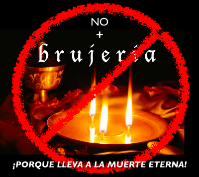

# Más de 186 muertes violentas relacionadas con brujería en la India
Ya sea por "error"al intentar sanar o por linchamiento, en la India la muerte se hace presente en actos de brujería.  

Se reportó el caso de una bruja que murió linchada y abandonada en el bosque porque fracasó a la hora de curar a un enfermo con sus "artes de brujería", en el remoto distrito de Sabrum. Ver la nota completa: [https://vanguardia.com.mx/amp/noticias/internacional/2759584-linchan-en-la-india-una-bruja-ATVG2759584]

### El caso merece nuestra reprobación en dos sentidos:
1. Porque Nuestro Señor no quiere la muerte del pecador, sino que **"se convierta y viva"**. (Leer Ezequiel 18, 23). Además, claro está, Dios nos ordena no matar en sus mandamientos santos.
2. Porque también Nuestro Padre eterno **aborrece la práctica de la brujería**, como de la magia, la hechicería, la adivinación, etc., facetas estas del ocultismo. La advertencia la podemos encontrar en la Sagrada Biblia, en el Libro de Deuteronomio 18, 9-14, como en Levítico 20, 6, y en el Catecismo de la Iglesia Católica, en los numerales 2116 y 2117. Transcribo el texto de este último número:

*"Todas las prácticas de magia o de hechicería mediante las que se pretende domesticar potencias ocultas para ponerlas a su servicio y obtener un poder sobrenatural sobre el prójimo —aunque sea para procurar la salud—, son gravemente contrarias a la virtud de la religión. Estas prácticas son más condenables aún cuando van acompañadas de una intención de dañar a otro, recurran o no a la intervención de los demonios. Llevar amuletos es también reprensible. El espiritismo implica con frecuencia prácticas adivinatorias o mágicas. Por eso la Iglesia advierte a los fieles que se guarden de él. El recurso a las medicinas llamadas tradicionales no legítima ni la invocación de las potencias malignas, ni la explotación de la credulidad del prójimo".*

Puede consultar el Catecismo completo en:
[http://www.vatican.va/archive/catechism_sp/p3s2c1a1_sp.html]  

Concluyo: La **práctica del ocultismo trae consigo, tarde o temprano, no solo problemas graves en todos los campos de la persona** -tanto para quien la administra como para quien la practica-, que no solo implica la muerte, sino también la muerte del alma, es decir, ¡la condenación!.

**¿Cree usted que estas 186 muertes en la India por brujería solo ocurren allá y en México no?**  
Sería importante saber, por parte de las autoridades de justicia en nuestro país, cuántos decesos u homicidios están vinculados con esta práctica, como con los asesinatos en rituales satánicos, a fin de advertir a los católicos sobre dicho peligro, orar por la conversión de los victimarios y, por supuesto, exigir su correspondiente prisión dada su amenaza para la seguridad y la paz ciudadana.