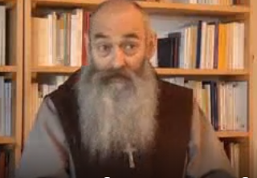

# De Gurú a sacerdote, Impactante conversión
El sacerdote belga **José María Verlinde** (Doctor en Filosofía y Teología) y autor del libro **"La experiencia prohibida"**, nos cuenta en este **IMPACTANTE** video su experiencia de búsqueda de sentido, de Cristo en su vida (más bien, de cómo Cristo lo buscó hasta Oriente).

Entre otras cosas, habla de cómo en 1968 -época de gran efervescencia y de movimientos de protesta- cuando era investigador de química nuclear se inició en las **ideas hindúes (como meditación)**. Luego, se convirtió hasta en secretario particular del gurú de los **Beatles Maharishi Mahesh Yogi**, con quien practicó el **Yoga** y la **"meditación trascendental"**; así, como discípulo suyo viajó con este casi tres veces por todo el mundo.

Más adelante, en su camino de encuentro y conversión con Jesús, se vio involucrado en prácticas ocultas (como **"curaciones energéticas", horóscopos, magia y brujería**). Así, fue médium y fue engañado por gente **esotérica**, quien le decía que esos poderes venían de "ángeles" o "entidades" espirituales. Sin embargo, descubrió que eran en realidad... **demonios**.

Tras muchas oraciones, fue liberado de esos poderes e **influencia maligna**. Así, continuó su caminar, sintió el llamado a la vida sacerdotal y en 1983 fue ordenando sacerdote. Actualmente es prior de la comunidad monástica de la Familia de San José, en Francia, y hoy da testimonio de su experiencia a todo el mundo.  

Fuente: Gloria.TV: [http://es.gloria.tv/?media=247077]  
¡Ayúdenos por favor a difundir esta extraordinaria historia a través de Twitter y Facebook!

**Oremos porque Jesús se encuentre con todos aquellos que se han apartado de su camino de Amor y Salvación.**  

