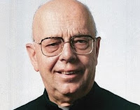

# Tiembla Demonio al oir nombrar a Juan Pablo II y Benedicto XVI
**"Hoy en día, dos mil años después de la venida de Cristo, la lucha es más feroz. Estamos en un choque final. Por un lado, el ejército de Satanás. Por el otro el ejército de Dios con todos sus santos y mártires, que derramaron su sangre en beneficio de los que permanecen en el combate. Cada gota de sangre de los mártires es usada por Dios en esa lucha continua contra el diablo".**  
*Gabriel Amorth (Sacerdote exorcista de la diócesis de Roma, con más de 75 mil exorcismos en su vida).*  

ROMA, 01 Mar. 12 / 11:15 pm (ACI).- El P. *Gabriel Amorth*, sacerdote **exorcista** de la diócesis de Roma (Italia) y uno de los más conocidos del mundo, aseguró que cuando menciona a Juan Pablo II y a Benedicto XVI, los demonios llegan al punto de llorar y suplicar que no los nombre más.

El informativo italiano La bussola quotidiana difundió un extracto del más reciente libro de Amorth, titulado "El último exorcista – Mi batalla contra Satanás", en el que el sacerdote asegura que al nombrar "a Juan Pablo II, los demonios escupen rabia. Otros tiemblan. Otros lloran y suplican que no lo nombre más. Y esto también sucede con Benedicto XVI".
*"Cada gesto de Joseph Ratzinger, su liturgia, son un poderoso exorcismo contra la furia del demonio".*

En el libro, escrito junto al vaticanista Paolo Rodari, Amorth señaló que **"Satanás ataca sobre todo al Papa. Su odio por el sucesor de Pedro es feroz. Lo he experimentado en mis exorcismos"**.

"Después del Papa, **Satanás ataca a los cardenales, obispos y a todos los sacerdotes y religiosos**. Es normal que sea así. Ninguno se debería escandalizar. Los sacerdotes, religiosos y religiosas, están llamados a una dura lucha espiritual".  

El famoso exorcista exhortó quienes han discernido por la vocación religiosa o sacerdotal a no ceder ante el diablo. **"Si abren la puerta de su alma al diablo, aunque sea ligeramente, éste entra y les toma toda su vida"**, afirmó.  

Amorh aseguró que "el mundo está bajo el poder del diablo. Y junto con Satanás muchos de sus profetas. Personas que la Biblia llama los falsos profetas. **Falsos porque llevan a la mentira y no a la verdad**".

"**Estas personas existen tanto fuera como dentro de la Iglesia**. Son fácilmente reconocibles: dicen que **hablan en nombre de la Iglesia pero hablan en nombre del mundo**. Exigen de la Iglesia que asuma los roles del mundo, y hablando así confunden a los fieles y llevan a la Iglesia a aguas que nos son las suyas. Son las **aguas del Maligno**".  

En su libro, el presbítero recordó que "la ira de Satanás ha existido desde el principio del mundo. Pero cuando Dios ha enviado al mundo a su Hijo, Jesús, esta rabia ha aumentado. Con la venida de Cristo el choque entre los dos ejércitos se hace directo. Satanás incita al pueblo contra Cristo y se las arregla para convencerlo de que debe matarlo".  

"La muerte de Jesús es la victoria de Satanás?. Una victoria aparente, porque en realidad con la Resurrección es Cristo quien triunfa. Pero su victoria no elimina el mal. No elimina la presencia del dragón, la bestia, Satanás. Éstos todavía permanecen, pero desde la venida de Cristo el hombre tiene la certeza de que, si confía en Él, puede vencer. A pesar de las dificultades de la vida puede vencer a la muerte".  

Ver nota íntegra en: (http://www.aciprensa.com/noticia.php?n=36209)  

Leer advertencia del padre Amorth sobre **Harry Potter:** (http://www.corazones.org/apologetica/harry_potter.htm#exorcista)

