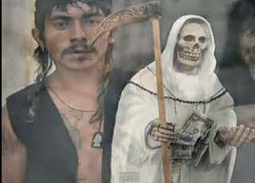

# Asesinos sacrificaban a sus víctimas para la "santa muerte"
**Ocho integrantes de una familia fueron detenidos en el estado de Sonora (México), acusados de presuntamente asesinar a dos menores y una mujer adulta durante rituales de sacrificios dedicados a la Santa Muerte.**

En declaraciones a la prensa de México, el portavoz de la Procuraduría de Justicia de Sonora, José Larrinaga, reveló que los implicados en los crímenes fueron detenidos el 27 de marzo, acusados de la desaparición de un menor de siete años.

 

Larrinaga reveló que los familiares acusados habrían confesado un total de tres asesinatos, cometidos como ofrenda para la Santa Muerte. Las vidas sacrificadas fueron las **de dos niños de 6 y 7 años, así como una mujer de 55 años**.

Con el testimonio de los inculpados, las autoridades constataron la ubicación donde fueron enterrados los cadáveres de las personas asesinadas.

"Los asesinaban con cuchillos. Lo que dicen ellos es que ofrecían la sangre a la Santa Muerte. Los cortaban en diferentes partes del cuerpo", afirmó el portavoz de la Procuraduría de Justicia de Sonora.

José Larrinaga manifestó que los acusados "**están confesando** esos tres (asesinatos rituales) pero la Procuraduría está haciendo más excavaciones en el lugar".

Fuente: Aciprensa, 1 de abril de 2012.

Leer más en: (http://www.aciprensa.com/noticia.php?n=36560)

Arquidiócesis pide alejarse de esta forma aberrante de culto:
(http://www.aciprensa.com/noticia.php?n=32267)

