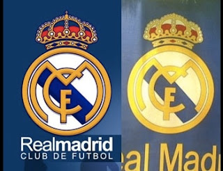

# Real Madrid cede ante mercado musulmán y elimina cruz de su escudo

MADRID, 30 Mar. 12 / 11:28 am (ACI).- **El diario deportivo Marca confirmó que el club de fútbol Real Madrid aceptó eliminar la pequeña cruz que desde 1920 luce en su escudo para evitar conflictos** en la multimillonaria construcción de un complejo turístico-deportivo en la isla de Ras Al Khaimah, una de las siete que forman los Emiratos Árabes Unidos, donde el Islam es la religión oficial.

 

El cambio –que exclusivamente afectará su imagen en los países musulmanes– fue confirmado ayer jueves 29 de marzo en el acto de presentación del resort de lujo que costará unos mil millones de dólares y abrirá sus puertas en enero de 2015.

Según informa el diario Marca, las autoridades del club han cuidado de "todos los detalles" y decidieron "prescindir de la cruz que hay en la corona del escudo para evitar de esta forma cualquier tipo de confusión o mal interpretaciones en una zona con gran mayoría de población que profesan la religión musulmana".

Leer la nota completa en: (http://www.aciprensa.com/noticia.php?n=36546) 

### Comentario
Es una pena que el club tomara esta decisión. Retirar la cruz es negar o soslayar su identidad; hacer a un lado a Cristo por respetos humanos, por privilegiar el negocio. Los musulmanes no retiran su Media Luna jamás, en ninguna circunstancia en Occidente (ni mucho menos en el fútbol). Tal complacencia tendrá su costo ante Dios: **"Quien me niegue delante de los hombres, yo lo negaré delante de mi Padre..."**, dijo Jesús. (Mateo 10, 33).  