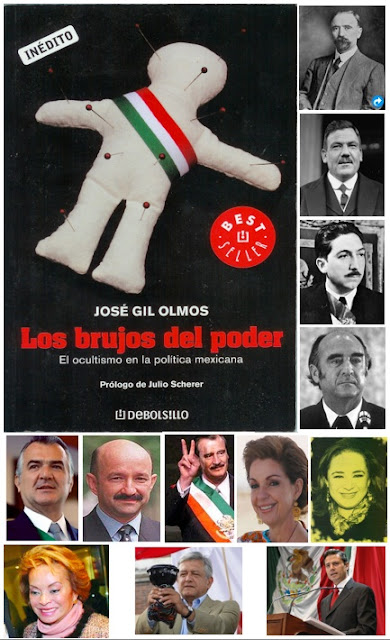

# Los brujos del poder. El ocultismo en la política mexicana
Desde **Francisco I. Madero, hasta Vicente Fox**, pasando por otras importantes figuras del mundo de la política, el espiritismo, el esoterismo, la adivinación y la brujería han rodeado al poder. Y las cosas no son muy distintas hoy.  

El prestigiado reportero del semanario Proceso, José Gil Olmos, relata en sus investigaciones publicadas en sus dos obras con el mismo titulo "Los brujos del poder" 1 y 2 (Ed. Random House Mondadori, 2007 y 2009) las andanzas de los presidentes **Madero, Calles y Alemán** en el espiritismo, como la recurrencia a los brujos de Catemaco de **José López Portillo, Miguel de la Madrid y Carlos Salinas de Gortari** (con el vudú).

 
Asimismo, cita a ex gobernadores priistas como **Mario Villanueva, Fidel Herrera (santería), Ulises Ruis, Roberto Madrazo y Beatriz Paredes, y a otras figuras como Francisco Barrio, Elías Ayub, Manuel Cavazos Lerma, Cuauhtémoc Cárdenas y Genaro García Luna** (este último encomendado al "Ángel de la Muerte", "un ángel negro que tiene en un altar en la privacidad de su oficina", asegura).

Destaca, de igual modo, el apoyo que doña **Elba Esther Gordillo** solicitó a un poderoso brujo negro de Africa para evadir la cárcel tras la llegada de Zedillo a Los Pinos y la ruptura de este con su antecesor Salinas, con el sacrificio de un León para que fuera poseída por el espíritu del animal (tras abrirlo en canal, sacarle las vísceras y untarlas en la maestra). Previamente la Sra. Gordillo, afecta a toda clase de rituales y prácticas, incluso la santería, mandó construir nichos en el Distrito Federal a la llamada "santa muerte" para su cuidado o protección.  

 Pero otro caso que llama mucho la atención y que revela no sólo la afinidad de miembros destacados del PRI con estas creencias y supersticiones, fue el caso de **Vicente Fox y Marta Sahagún**, donde la entonces "Primera Dama" (figura jurídica que no existe en México) era fanática a prácticas New Age (como "energías", "meditación", medicina alternativa, "chamanes", hinduismo, "ángeles zodiacales" y hasta brujería). 

Gil Olmos confirma lo que otros reporteros -y aún este investigador- ya sabíamos de "Martita": el suministro de "vitaminas" (toloache) a Fox. (¿Para qué?) Lo anterior, como refiero en mi libro "Nueva Era vs. Buena Nueva", sin mencionar la contratación que hizo Sahagún de los servicios de **Rebeca Moreno** en la Presidencia de la República como Directora de Logística (dotada, a decir de ella, de ""poderes psíquicos, paranormales y astrológicos", y conocimientos en "ciencias ocultas"). A Moreno se le llegó a denominar, por ello, "la bruja oficial de Los Pinos".

En fin, las anécdotas abundan al respecto (y no sólo a nivel federal, sino estatal y municipal) como los señalamientos directos y rumores de involucramiento de funcionarios en el ocultismo y, aún, en el satanismo (nombres que tengo pero que no puedo revelar hasta confirmarlo). Lo cierto es que, hasta hoy, ningún actor político señalado por Olmos ha negado su información periodística ni tampoco lo han acusado legalmente por difamación.  

Subyace una pregunta: ¿Alguno de los candidatos actuales a la Presidencia de México "ha sido seducido por el lado obscuro de la fuerza" (en términos de Star Wars)? La respuesta es sí: **Andrés Manuel López Obrador**. Gil Olmos habla de cómo el perredista en 2006 recibió en Catemaco una limpia-ritual del chamán "Lobo Negro" y recibió una "loción" de la chamana "Chabelita". Brujos y chamanes pronosticaron su triunfo sobre Calderón y Madrazo, en 2006. (Hoy no hay constancia de que siga consultando esas "fuerzas ocultas").  

Por otra parte, el autor refiere en su libro 2 algo curioso: Una "profecía" desde 1942 según la cual uno de los miembros del llamado **grupo Atlacomulco** (que ha gobernado en la entidad durante más de 50 años) sería el próximo Presidente de la República. Señala que ese año la vidente de Atlacomulco, Estado de México, doña Francisca Castro Montiel, "reunió a los hombres más importantes del municipio y les dio a conocer la profecía que los marcaría por varias generaciones: "Seis gobernadores saldrán de este pueblo. Y de este grupo compacto uno llegará a la Presidencia de la República". 

La historia indica que **ni Hank, Baz, ni Jiménez Cantú, ni Del Mazo, ni Chuayffet ni Montiel** lo consiguieron. ¿Será finalmente Enrique Peña Nieto quien haga 'válida' dicha predicción?  

Yo quiero que el próximo Presidente de mi país sea un católico ejemplar, comprometido con México y con su fe en Cristo, no alguien que sea masón ni comulgue con ideas Nueva Era ni ocultistas. ¿Ustedes qué dicen?

**"No ha de haber nadie en ti que haga pasar a su hijo, o a su hija por el fuego, que practique adivinación, astrología, hechicería o magia, ningún encantador ni consultor de espectros o adivinos, ni evocador de muertos. Porque todo el que hace estas cosas es una abominación para Yahvéh tu Dios; y por causa de estas abominaciones , desaloja Yahvéh, tu Dios, a esas naciones delante de ti. Has de ser íntegro con Yahvéh, tú Dios". (Sagrada biblia, en Deuteronomio 18, 9-14).**  