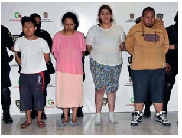

# Saca mamá ojos a su hijo en ritual ocultista

En el municipio de Nezahualcóyotl, estado de México, se registró ayer el caso de una madre que sacó los ojos a su hijo de cinco años en un ritual (algunos medios indican que de **santería** y otros refieren que de **satanismo**) quien se encontraba aparentemente drogada.
Autoridades de la Procuraduría de Justicia del estado acudieron a un domicilio particular luego de recibir el llamado de auxilio de los vecinos, quienes escucharon gritos en el inmueble. En el lugar se encontraron a tres personas atadas a un palo. Se detuvo a cinco personas, todas ellas familiares del pequeño.

  

Según diversas fuentes informativas, la señora "Carmen", madre del menor "Fernando", arengaba que "se va a acabar el mundo, ya viene el final", y pidió a todos cerraran los ojos; pero el menor no lo hizo y su mamá y su hermana se enojaron y le extrajeron los órganos oculares al pequeño con una cuchara, frente a un bebé y otro niño. El diario Excélsior citó que, tras ser detenida, la señora aseguró que en su "secta" le alertaron que el próximo lunes habría un temblor muy fuerte, por lo cual debían estar rezando.
 "Fernando" fue trasladado al Hospital Infantil de Tacubaya y su estado de salud se reporta grave.
En abril pasado una familia de Sonora sacrificó a parientes en un rito ofrecido a la llamada "santa muerte", ante la presencia de menores de edad.

**"*Por sus frutos los conoceréis..." (Mateo 7, 20)*.**