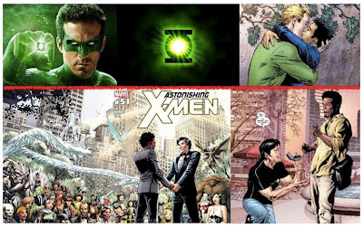

# Super héroes, ¿gays?
En un hecho inédito, la empresa **DC Cómics** anunció el pasado 1 de junio que el miembro de la "Liga de la Justicia", **Linterna Verde**, es ¡homosexual!

La noticia acaparó las secciones de espectáculos de diversos medios nacionales e internacionales y causó diversas reacciones, muchas de las cuales fueron de aceptación por parte de los fans. También hubo expresiones de rechazo por parte de otros seguidores, quienes vieron la noticia como negativa y denigrante de la imagen de un valeroso defensor de la Tierra.

 

Pero no fue **DC Cómics** la primera empresa en revelar la "verdadera identidad" de un superhéroe, pues a fines de mayo, una semana antes, su competencia la **Editorial Marvel** dio a conocer en uno de los números de sus revistas que **"Northstar"**, miembro de **"Astonishing X-Men"** (colección inicial de los famosos X-Men) se casaría con su novio Kyle Jinadu en Nueva York. Así, será el 20 de junio cuando Marvel publique en la revista No. 51 a los "felices novios" vestidos de esmoquin en su enlace nupcial (ante la presencia del resto de los X-Men).

Cabe mencionar, a propósito, que **Marvel** (creada por Stan Lee y Jack Kirby) presenta algunos de los X-Men actuales con poderes ocultistas (como telepatía, telequinesia, telequinesia, control mental, entre otros). Y recordemos que esta editorial también es la "creadora" de **Thor, Capitán América, Iron Man y Hulk** (de reciente aparición juntos en el exitoso film "Los Vengadores").

Se informa que "Northstar" es un superhéroe que posee la capacidad de volar y moverse a altísima velocidad. Apareció por primera vez en las páginas de los cómic de Marvel en 1979 como miembro del grupo de superhéroes Alpha Flight. En 1992, confesó su homosexualidad públicamente y posteriormente ingresó en las filas de X-Men.

Al respecto, es evidente cómo **Marvel y DC Cómics** -líderes en historietas de superhéroes en Estados Unidos- pretenden mañosamente inducir en los niños y adolescentes el tema de la homosexualidad, para hacerlo ver entre ellos como un hecho "normal", común y socialmente aceptable. Dicha acción forma parte de la estrategia de manipulación mediática de gran número de estrellas de **Hollywood**, y se enmarca también en el contexto político de la **campaña de reelección de Barack Obama a la Casa Blanca**. (Recientemente el presidente estadounidense se burló públicamente de la Biblia y se manifestó a favor del lesbianismo y la homosexualidad en su campaña).

**La Iglesia ha expresado** su oposición a las "uniones homosexuales" y mantenido una postura de respeto y caridad hacia las personas, hombres y mujeres, que han optado por asumir esa actitud. Lamentablemente líderes de opinión sin escrúpulos tachan a nuestra fe, Iglesia o religión como intolerante y homofóbica (pero se les olvida que son hermanas religiosas que cuidan de miles de hombres y mujeres en hospitales cristianos, víctimas de VIH).

Puede conocerse con más detalle del tema en la **"Carta a los Obispos de la Iglesia Católica sobre la atención pastoral a las personas homosexuales"**, de la Congregación para la Doctrina de la Fe (1986) en el siguiente link, cuya lectura recomiendo ampliamente:
(http://www.corazones.org/doc/homosexualidad_cong_doct86.htm)

**Oremos al Señor** porque estos hermanos nuestros reconozcan el Amor de Dios en su persona, sanen sus heridas internas, se conviertan a Dios, recuperen la identidad sexual que Él les dio y se reinserten plenamente y sin rencor a su vida social, como ya está sucediendo en distintas partes con algunas de estas personas.

**"¿No sabéis acaso que los injustos no heredarán el Reino de Dios? ¡No os engañéis! Ni impuros, ni idólatras, ni adúlteros, ni afeminados, ni homosexuales, ni ladrones, ni avaros, ni borrachos, ni ultrajdores, ni explotadores heredarán el Reino de Dios"**. 1 Corintios 6, 9-10

