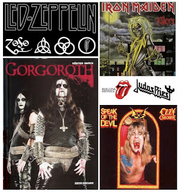
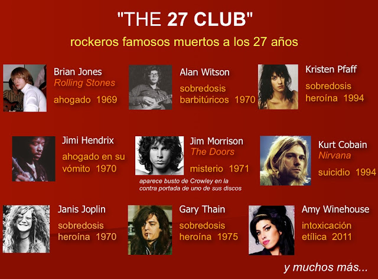
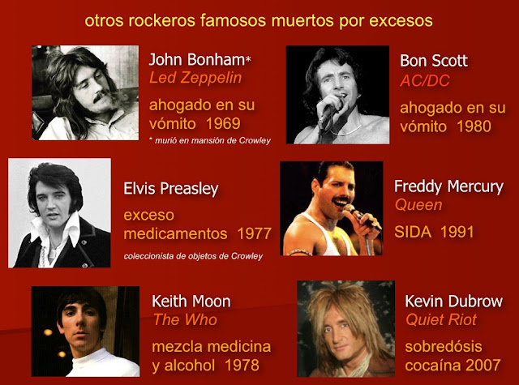

Hasta el experto de **Black Metal** en Colombia le tiene miedo al satanismo. Patricio contó cómo se fue adentrando a un mundo tan diabólico y oscuro que se volvió insoportable.  

 

**Comentario**
En mis múltiples viajes por el país he conocido varios casos de jóvenes cuyas madres preocupadas se acercan a a mi a platicarme acerca del extraño estilo de vida de sus hijos, en cuyo discernimiento encuentro puntos en común: adicción (sexo, drogas y alcohol), desobediencia a los padres, rebeldía per se, bajo rendimiento escolar, apatía, soledad, depresión, lanzan majaderías y maldiciones cada instante, descuido en su arreglo, visten ropa negra, fuerte actividad nocturna, rechazo a Dios y a lo sagrado, afiliación a grupos oscuros (darks, góticos, vampiros, satánicos, etc.) **y afición desmedida al rock** en sus vertientes más fuertes *(acid, hard, heavy, black, bull y black)* al escuchar esta música diariamente a todo volumen y en todo momento. 

**Para decirlo brevemente** Estos chicos (a sabiendas o por ignorancia) rindieron su mente, corazón y voluntad a Satanás, el cual los tiene bloqueados y sometidos a su querer cuando iniciaron escuchando a bandas de rock oscuras en cuya música se graban mensajes subliminales o en donde la letra de la canción realiza frecuentemente consagraciones al Maligno. Por tanto, los escuchas son susceptibles a posesiones demoníacas, al suicidio y a cometer crímenes. Asimismo, al poner esta música oscura, las blasfemias e imprecaciones de los cantantes o grupos son invocaciones al Demonio y a sus espíritus malignos.  

**¿Qué necesitan estos jóvenes?** 
Lo que requieren con urgencia estos chavos es de mucha oración, de una Consagración a los Sagrados Corazones de Jesús y de María, del rezo del santo Rosario, de Comuniones y de mucho amor de sus padres (y en casos más severos de oraciones de liberación de un sacerdote católico); sólo así podrán convertirse y liberarse de las tinieblas presentes en su mente y corazón. ¡Cristo, Jesús, es la Luz, el Camino, la Verdad y la Vida! (Ya hay miles de testimonios de chicos que han vuelto de la oscuridad a una vida mejor, libre y alegre, gracias a Dios).  

En otro artículo hablaré más al respecto del origen oculista del rock, con el **"Libro de la Ley"** de Aleister Crowley (fundador del satanismo) y su influencia nefasta en **Ozzy Osbourne** de **Black Sabbath, The Beatles, Rolling Stones**, entre otros. De igual modo, queda para una nueva oportunidad analizar el caso de **Lady Gaga**. Un tema más de interés será indagar en la influencia de los videojuegos en los niños.  

Si aún dudan, chavos o señores padres de familia, de la influencia negativa, adictiva y destructiva de la música oscura, les invito a consultar el siguiente material:  

¿Dónde informarse más?
- Pbro. Ramón Ricciardi, **¿Por qué el rock es malo?** Ed. Verdad y Vida, México, s/a.*
- Carlo Climati, **Los jóvenes y el esoterismo**, Ed. San Pablo, México, 2000.*
- Pbro. Jean Paul Regimbal, **¿Queremos rock? Conozcamos las consecuencias**, s/Ed, s/a.*
- Varios autores, **La música satánica**, Librería Espiritual, Quito, s/a.*
- Germán Villegas Naranjo, **Al borde del abismo**. Mensajes subliminales música rock y satanismo, Ed. Paulinas, Bogota, 2002.*
- Pbro. Corrado Balducci, **Adoradores del Diablo y rock satánico**, Ed. Lumen, México, 2002.*
- Julio Hernández, **Satanismo en tu idioma**, Ministerios de fuego, CD (en español)

*La mayoría de este material bibliográfico lo puede usted localizar en la Librería Parroquial de Clavería, Azcapotzalco, México. Tels. (55) 5386 0443 y (55) 5399 1243*

> Estudio sobre los daños físicos, psicológicos y morales del rock:
http://html.rincondelvago.com/efecto-del-rock-en-los-adolescentes.html 

> Libro: "The satanic roots of rock"2, de Donald Phau: http://www.av1611.org/othpubls/roots.html

> Congreso de exorcistas en Lyon, Francia, 2005, donde abordaron en tema del rock:
http://www.margencero.org/musica/satan/congresodeexorcistasdelrock.htm

 

 

