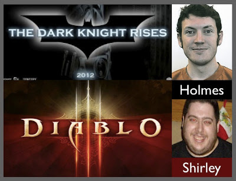

# Del Diablo III a Batman 3; adicción, obsesión y muerte
Dos noticias acaparan nuestra atención en las últimas semanas; ambas, relacionadas con la industria del entretenimiento y del espectáculo: La muerte de un joven taiwanés tras jugar un videojuego sobre el Maligno, y el asesinato de más de una docena de personas en Denver, a manos de otro joven, en el marco del estreno de Batman. Veamos: 

1. El 15 de julio distintos medios nacionales e internacionales informaron sobre la muerte de Chuang, un joven de 18 años de edad de Taiwán, quien falleció en un cibercafé tras haber jugado 40 horas seguidas (tres días) **el videojuego "Diablo III"**, de Nintendo. No obstante, no fue el primer caso de fallecimiento registrado por esta causa, pues en mayo pasado Russel Shirley, de 32 años, murió de un infarto tras jugarlo.

2. El viernes 20 de julio, un estudiante de doctorado en Neurociencias, James Holmes, lanzó granadas de humo en un cine en Denver y atacó con armas de alto poder al público durante el estreno nacional de **"Batman III: el caballero de la noche asciende"**. El saldo hasta hoy: 12 muertos y más de 50 heridos. Barack Obama decretó 6 días de luto nacional.

 

Las notas me llevan a comentar brevemente ambos casos fatídicos y repudiables desde dos perspectivas: la adicción a los videojuegos y la fascinación por el ocultismo entre la niñez y la juventud.

## Sobre la adicción a los videojuegos
Diré que comprendo muy bien del tema porque yo mismo fui adicto a la TV durante más de 8 años. Tras dejar esta fascinación en el año 2000, luego de casarme, salté a otra seducción poderosa: El juego de fútbol americano Madden, en mi PC. Era tremenda la pasión que ejerció sobre mi este deporte, pero no es lo mismo practicarlo en realidad en una cancha con otros jugadores, de manera disciplinada, que hacerlo sin ton ni son, virtualmente y usted solo. Yo jugaba y jugaba sin parar no nada más los fines de semana, sino también entre semana hasta en la madrugada, pues deseaba mejorar mis marcas.  

A cada quien le afectará diferente esta atracción, según el tipo de programas y videojuegos que observe continuamente. En mi caso, la adicción a la TV y al videojuego citado me afectaron mucho durante el tiempo que permanecí "enchufado": Amanecía cansado (dormía pocas horas), no me concentraba en el trabajo y me dolía la cabeza (fatiga mental), aumentó mi egoísmo (sólo pensaba en mí), me irritaba fácilmente, me dolían las manos, creció mi sedentarismo, me deprimía con frecuencia, etc. Esto, sin mencionar el descuido de algunas responsabilidades, el gasto en la luz y la pérdida de tiempo. ¡Claro! Discusiones con mi esposa. ¡Caray, yo ya tenía 33 años de edad! (Hoy tengo 43).  

He leído y sabido de casos similares al mío, con mayores trastornos físicos, mentales y emocionales, que pueden ir desde la pérdida del apetito y del sentido de la realidad, hasta la violencia y la muerte. Le invito a leer la nota de El Universal "adicción a videojuegos ocasiona problemas mentales" sobre varios estudios serios al respecto. <http://www.eluniversal.com.mx/articulos/62489.html>

## ¿Qué cómo dejé esta fascinación?
Fue mi conversión a Cristo la que me ayudó a romper con la adicción televisiva y el videojuego Madden, definitivamente. (Una experiencia extraordinaria que en otra ocasión platicaré). Sí, El Señor me liberó de una vez y para siempre de esta terrible esclavitud; sólo él tiene el poder para lograrlo (por más fuerza de voluntad que usted ponga). Hoy rezo y predico por la liberación de otros "presos", como lo estuve yo, y por la conversión de quienes incurrieron -a sabiendas y por error- en el ocultismo.  

## Sobre los videojuegos obscuros
Este es todo un tema que requiere otras entregas. Por ahora diré...

Cualquier tipo de videojuego -ya sea de deportes, de superhéroes o de entretenimiento en general- y de todas las marcas (Xbox, Wii, Nintendo, etc.) muestran una leyenda en la caja de estuche que advierte sobre **"ataques epilépticos fotosensibles"** con una serie de síntomas que deben observarse, luego de lo cual debe dejar de jugarse e ir con un médico: mareos, visión alterada, tics nerviosos, temblores en brazos y piernas, desorientación, confusión o pérdida momentánea del conocimiento o incluso convulsiones. ¿Lo sabía? Y esto sin contar la temática propia del juego, donde la muerte, el odio, la sangre, la guerra, la destrucción, la violencia, el sexo, etc. se muestran sumamente explícitos.

De hecho, desde 2011 hasta hoy existe un fuerte debate social y político en Estados Unidos acerca de poner una etiqueta en estos a fin de advertir sobre posibles efectos en los jugadores, como ocurre hoy en las cajetillas de cigarros: "Advertencia: exposición a juegos violentos se asocia a conductas agresivas".  

Al respecto, es curioso encontrar ciertos patrones de vida en aquellas personas que perpetran asesinatos terribles, a sangre fría: Disfunción y violencia intrafamiliar, desamor, soledad, películas y videojuegos violentos, rock duro y ocultismo; ¡un cocktail explosivo! ¿Fue lo que ocurrió con James Holmes? Hasta ahora, las autoridades no han informado el perfil completo del estudiante asesino; ya veremos. 

Desde luego que existen otros factores como la ideología política, las motivaciones racistas y la posesión de armas legales que, en este u otros casos famosos como las masacres de **Columbine (1999)** o de **Noruega (2011)**,forman parte también de la problemática.

De igual forma podríamos agregar aquí el contenido mismo de la cinta Batman (del Director Christopher Nolan) la cual en su trilogía, desde su parte I y II, muestran a un superhéroe más oscuro y vengador acompañado de enemigos más fuertes y violentos, con escenas fuertes no aptas para niños. Por cierto, ¿ha notado que, de un tiempo para acá, los chicos muestran más predilección por los villanos que por los héroes? Eso no pasaba cuando yo era niño; todos queríamos ser Superman, Acuaman, etc.  

La extraordinaria actuación, por ejemplo, de Heath Ledger (muerto antes del estreno de "el caballero de la noche") cautivó a miles. ¿Será por ello que el joven Holmes -fanático del Guasón- lo imitó al identificarse con él cuando usó las granadas de humo en el ataque al cine? ¿Era fanático del videojuego **Batman: Arkham City del murciélago?** El joven de 24 años que -según testimonios portaba una máscara antigás y un chaleco antibalas- gritaba mientras abría fuego: "Soy el Guasón".

En torno al **juego "Diablo III"** -que por desgracia ha entusiasmado a millones de personas- recuerdo el caso referido en Estados Unidos por el pastor Josue Yrion -famoso por denunciar a las películas de Disney- quien relató cómo un niño cayó al piso luego de haber concluido con éxito la misión del juego "Diablo I". (El objetivo del juego consiste en ver el resto del Demonio, luego de pasar pruebas y pruebas; ese es el premio). Los médicos diagnosticaron en el pequeño un "ataque epiléptico".

Un caso similar a este ocurrió en 1997 en Japón, cuando 685 niños fueron llevados con urgencia al hospital luego de ver el capítulo No. 38 de Pokemon ("monstruos de bolsillo"), caricatura producida curiosamente también por Nintendo. Los médicos reportaron ataques de histeria y epilepsia.

Mis investigaciones me llevan, sin embargo, a discrepar de estos dictámenes médicos pues la patología presentada en el peque del videojuego mostraba, más bien, síntomas que concuerdan exactamente con una posesión demoníaca. Sí, tal deseo de ver al Maligno -como el de escucharlo o alabarlo- son invocaciones eficaces para que sus espíritus malignos infesten un lugar o penetren en la persona. Y en relación a los televidentes de Pokemon, no opino distinto, ya que esos "monstruos" son **demonios** (cuya traducción del japonés al español así lo revelan).

 

Chuang y Shirley jugaron el video del **"Diablo III"** y murieron por inanición -al pasar continuamente tantas horas frente al televisor, con parte de las consecuencias que mencioné incluso en mi caso por la adicción a la TV y al juego de Madden- y, por extraño que le parezca... ¡por influjo del Enemigo! Así, por jugar con la ouija, han muerto también personas.

Y las víctimas de Holmes, en Denver, murieron a manos de un desquiciado, un joven obsesionado con la saga de Batman -conducta anómala propiciada, igualmente, por el Malo.

Recuerde y atienda 2 cosas:
1. Satanás puede provocar males cuando se abandona a Dios y se acerca uno a sus dominios; este ser angelical ya está vencido, fue derrotado por Cristo en la Cruz y San Miguel Arcángel.
2. Cuide por favor lo que ven y juegan sus hijos, ponga límites y horarios a la TV, lea libros, ame a sus hijos y, sobre todo... ¡acérquelos a la fe en Nuestro Señor Jesucristo!

