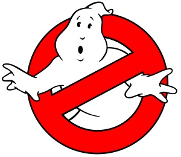

# ¿Existen los fantasmas?
¿Qué hay también de las "almas en pena" y de los espíritus? ¿Existe ese mundo sobrenatural? Y, más aún, ¿puede manifestarse en nuestra vida concreta?  

 

En efecto, **como católicos sabemos que el mundo espiritual existe y lo profesamos en el Credo** no es ciencia ficción por más que muchos pseudo intelectuales intenten negar. Se trata de una realidad extraordinaria, imperceptible por nuestros sentidos para la mayoría, presente en nuestra vida diaria más de lo que suponemos. Dios es Creador "de todo lo visible e invisible".  

En principio diré que la doctrina cristiana expuesta en diversas fuentes, como en el Catecismo de la Iglesia, nos habla de un **mundo angelical**, dimensión igualmente reconocida por papas, teólogos, doctores y santos. Así, la existencia del Cielo, del Purgatorio y del Infierno, ha sido reconocida y predicada por el Magisterio, con base principal en la Palabra de Dios contenida en las Sagradas Escrituras.  

**Los "novísimos"** es una rama de la Teología que nos habla precisamente de las "cosas últimas": muerte, juicio, Cielo, Purgatorio e infierno. Todo esto, recogido del Antiguo y del Nuevo Testamento. Hablamos igualmente de Escatología, aunque esta se refiere más a los "últimos tiempos". ( Ver numerales 1020 a 1060 sobre **la "vida eterna"** en: <http://www.vatican.va/archive/catechism_sp/index_sp.html> . Léase la Encíclica Spe Salvi, del Papa Benedicto XVI (2007), sobre la vida eterna también: <http://www.corazones.org/doc/spe_salvi.htm> .

**Nuestro Señor Jesucristo en su Evangelio hablo en diversas oportunidades de estas realidades**, cuya enseñanza, por supuesto, sigue vigente no obstante que algunos sacerdotes, religiosos y hasta Obispos han dejado actualmente de citarlas en sus charlas, conferencias y homilías, por cuestiones más bien de pérdida de la fe, o bien, por "respetos humanos" y cobardía. 

**El Papa Juan Pablo II llegó a decir** al respecto: "El hombre en una cierta medida está perdido, se han perdido también los predicadores, los catequistas, los educadores, porque han perdido el coraje de 'amenazar con el infierno'. Y quizá hasta quien los escuche haya dejado de tenerle miedo". (Cruzando el Umbral de la Esperanza, 1994).

De este modo, **existen innumerables testimonios** relativos a visiones y audiciones que confirman, de manera tangible, la "vida después de la vida", la existencia del "más allá". Por ejemplo: apariciones y presencias de ángeles, luces brillantísimas, voces celestiales, "escarcha", movimiento sensible de objetos, mensajes al oído, locuciones (voz interna), etc.

En este punto es **muy importante, sin embargo, discernir correctamente el origen, la forma, el fondo y el fruto de esas manifestaciones** porque podrían provenir del Demonio. Recordemos que Satanás es "padre de la mentira", un ser real espiritual, un ángel que fue bello, que tiene el poder de convertirse en "ser de luz". (En otra ocasión posterior escribiré aquí acerca del tema de los "ángeles" de la Nueva Era, por el peligro que su invocación tiene, dada la ignorancia de la gente, que no sabe distinguir entre aquellos que sirven a Dios y aquellos que finalmente son malignos). En mi libro, hasta abajo del blog, abordo el tema con más extensión.  

Es más fácil que se den apariciones angelicales malignas que presencia de ángeles fieles a Dios, no porque hayan más demonios ni sean más poderosos que Dios, sino porque estos están listos para manifestarse a nosotros y cumplir nuestras peticiones tan pronto como se les invoque para engañarnos y perdernos.  

## Entonces, ¿existen los fantasmas? 
Para responder debemos precisar qué entendemos por "fantasma": ¿un espectro, un ente, un ángel, un muerto, un espíritu puro, un "ser de luz", un "alma en pena"...? En México se habla de la "llorona", una mujer fantasmal que llora la muerte de sus hijos muertos (asesinados por ella, por su marido o fallecidos por cualquier otra causa).  

**El Pbro. Gabriele Amorth**, famoso exorcista italiano, niega la existencia de los fantasmas en su libro "Habla un exorcista", Ed. Planeta. Más bien, lo que sí existe -y acabo de apuntarlo- es el mundo angelical: ángeles fieles al Señor y ángeles caídos (espíritus inmundos). (Ver numerales 325 - 326 del Catecismo). Por tanto, muuuuchas apariciones sobrenaturales "fantasmagóricas" son, más bien, ¡espíritus malignos! ¡Cuidado! Y son el ocultismo y el esoterismo vías, "antenas" o canales por medio de los cuales estos demonios se manifiestan, común y sensiblemente a las personas. Ejemplos terribles de esas trampas: La ouija y el espiritismo.
 
Me remito de nuevo al Catecismo: **Cuando morimos sólo tenemos esos tres destinos: Cielo, Purgatorio e Infierno**, que más que lugares físicos son estados del alma conforme a la vida en la Tierra luego de su juicio personal ante el Tribunal Santo de Dios. Quienes, por los méritos de Cristo y el amor alcanzan la Gloria eterna, disfrutan de la "visión beatífica" de Dios e interceden (como Iglesia triunfante) por los vivos; quienes purifican su alma en el Purgatorio, ya vieron a Dios pero aún no están plenamente en su presencia, y quienes desgraciadamente murieron en pecado están prisioneros en el "lago de fuego". Estos últimos no pueden salir de allí, ¡jamás!  

Así, la manifestación tangible de **las llamadas "almas en pena"** es verídica; se trata, sin embargo, de casos excepcionales donde Dios permite que el alma de una persona se haga presente mediante sueños, señales visibles o incluso presencia incorpórea a amigos y familiares para pedirles favores con objeto de ayudarles a llegar al Cielo, pero no para causarles espanto ("ni jalarles las patas en la noche", como dijo aquél). No es pues esto un mito ni un horrible relato más de "La mano peluda" o de "Extranormal".

A este último respecto, **el libro de Nicky Eltz titulado: "¡¡Ayúdennos a salir de aquí!!"**, es interesante y sorprendente. En este, la autora comparte la entrevista a María Simma (una mujer europea mayor de edad quien durante años recibió la misión de ayudar a las almas del Purgatorio, las cuales la visitaban diariamente). Excepto por el tema del "limbo", su lectura es recomendable. La señora Simma tenía su director espiritual y el obispo estaba informado del caso (hasta en Roma estaban al tanto).  

