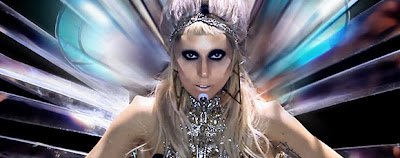

# Lady Gaga: 'Born this way' significado oculto

Lady Gaga "Born This Way" introduce a los espectadores el nacimiento de una "nueva raza" y un nuevo mundo, utilizando imágenes de una narrativa compleja y precisa. Se trata de un viaje psicodélico lleno de símbolos ocultos y arquetípico, que cuenta la historia de un nacimiento cósmico y nuevos ideales. Sin embargo, detrás de su mensaje de aceptación hacia el exterior, un mensaje más siniestro se encuentra incrustado en el simbolismo de la fuente. Veremos el significado fundamental de "Born This Way" y analizar el significado de la simbología oculta en el video.

 

Lady Gaga está de vuelta. Y ella trae cuernos en la frente. En el espacio. Y está haciendo música de baile de los 90. "Born This Way" parece provocar en las personas dos reacciones opuestas, dependiendo de su conocimiento del simbolismo oculto. O bien es "¿Qué diablos acaba de suceder aquí?" O "Esto es realmente flagrante". La razón es simple. El video contiene nuevos elementos extraños que pudieran confundir a los espectadores pero también contiene un simbolismo que es muy antiguo. Aunque el vídeo está ambientado en un mundo futurista, intergaláctico, tiene que ver con el concepto más primitivo de la humanidad: la maternidad. Se juega con la fascinación humana arquetípica y / o repulsión hacia el acto de dar a luz.

Aunque la letra de Born This Way son acerca de la aceptación incondicional, con un enfoque especial sobre la homosexualidad, el alcance del video va mucho más allá del tema de la orientación sexual. Narra el nacimiento de una nueva raza dentro de la humanidad. Laurieann Gibson, el director creativo del video describe este concepto:

**"Al principio, cuando pensé en dar a luz una nueva raza y la adición de la prótesis, pensé que tal vez debería haber una cierta manera de caminar o tal vez moverse de cierta manera, pero luego me di cuenta de que es en realidad una raza dentro de nuestra raza , es un modo de pensar ".** - [Fuente](https://www.mtv.com/news/1659163/lady-gaga-born-this-way/)

Gaga no está dando a luz a un ser humano sino a una "nueva raza" en la humanidad. El simbolismo del video deja en claro que este nacimiento no es natural, sino provocada artificialmente. Una concepción inmaculada trenzada. Como es el caso de la mayoría de los videos de Gaga, el tema del control mental es importante en el video. Es el proceso mediante el cual la metamorfosis se llevará a cabo. En términos de programación Monarca, estamos presenciando el nacimiento de un nuevo personaje dentro de la "personalidad de base" de la humanidad. El nacimiento está sucediendo en la mente de la gente y se ve representado por espeluznante cuernos faciales.

Leer más en: <http://contraelnwo.blogspot.mx/2011/03/lady-gaga-born-this-way-el-manifiesto.html>

Fuente: [TheVigilantCitizen](http://vigilantcitizen.com/?p=7160) traducción: [Contra el Nuevo Orden Mundial](http://contraelnwo.blogspot.com/)