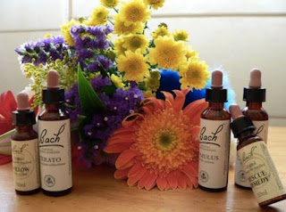

Reproducimos a continuación un artículo del periodista **Xabier Iglesias** sobre la terapia tan extendida en la Nueva Era de las “flores de Bach”. Con el título “Si me hablas de Bach yo pienso en Sebastian” ha sido publicado el pasado mes de agosto en su blog “Ciencia y origen”, dentro de la edición digital del diario español El Correo.  

 

Las flores y yo mismo no somos muy buenos amigos. Recuerdo que en la facultad, misteriosamente, las asignaturas que mejor se me daban eran las de botánica, pero a la hora de la verdad siempre tengo problemas con mi macetohuerto, pierdo casi todas las cosechas, mi bonsai no tiene buen aspecto y hasta las plantas interiores sufren estrés hídrico cuando no están ahogadas. A todo esto hay que sumarle que me producen alergia.  

He aquí la razón de este post, ya que arrastro una rinitis aguda desde hace algunos días. Hace tiempo que dejé de tomar antihistamínicos cansado de que mi médico de cabecera me utilizara como ratón de laboratorio haciéndome probar todas las marcas del mercado. En más de una ocasión llegué a pensar que el alivio instantáneo y poco duradero que algunas de aquellas pastillas me provocaban no era más que un efecto placebo. Para los profanos, cuando se hacen estudios estadísticos para conocer la efectividad de un medicamento, siempre se contrastan con los datos que aporta otro grupo de personas a las que se les da una medicación inocua, sin efecto alguno.
Tras esta introducción es cuando estoy en disposición de afrontar el tema central de este post, Las Flores de Bach.

Este método de “sanación” (me niego a llamarlo medicina) fue ideado por el Doctor **Edward Bach** en los años 20 en Inglaterra. El Dr. Bach era bacteriólogo y estudiaba enfermedades intestinales. Clasificaba las bacterias intestinales dependiendo de la actividad metabólica que éstas llevaban a cabo, midiendo las cantidades de azúcar que fermentaba cada especie. Enfermó y se le diagnosticaron 3 meses de vida pero el final anticipado no fue tal y el Dr. Bach tuvo la revelación de que había vencido a la parca gracias a su felicidad y su pensamiento positivo. Concluyó que el estado mental tenía un efecto directo sobre el estado físico.  

“La gente como nosotros que ha saboreado la gloria del sacrificio, la gloria de ayudar a nuestros hermanos, una vez que se nos ha dado una joya de tal magnitud, nada puede apartarnos de nuestro camino de amor y de deber para mostrar al mundo su brillo puro y sin adornos”. Fue en esta época cuando abandonó la investigación para acercarse a la Homeopatía. “Quiero hacerlo tan sencillo como esto: si tengo hambre voy a la huerta y saco una lechuga para el té; si estoy asustado y enfermo, voy y tomo una dosis de Mimulus”.  

El método de las Flores de Bach se basa en 38 combinaciones de flores de diferentes especies en los que cada flor está relacionada con un estado anímico básico. Si estás triste tomas una, si estás asustado otra y así hasta completar todas, todo sustentado en la idea de que la curación emocional tiene repercusión en otros planos.
La realidad es que se ha demostrado científicamente que esta terapia no tiene mayor efectividad que un placebo por lo que si van a recurrir a remedios naturales les recomiendo que para plantas mejor la fitoterapia, que tiene una base química y está mucho más cercana a la medicina.  

**Walach, H., C. Rilling, U. Engelke (2001)**. «Efficacy of Bach-flower remedies in test anxiety: a double-blind, placebo-controlled, randomized trial with partial crossover». J Anxiety Disord 15 (4, p. 359-366). «Eficacia de los remedios florales de Bach en ansiedad por examen: un ensayo doble ciego, placebo-controlado, de selección al azar con entrecruzamiento parcial»

RESULTADOS: No hubo diferencia significativa entre los grupos, pero un descenso significativo en la ansiedad de examen se presentó en todos los grupos. CONCLUSIÓN: Nosotros concluimos que los remedios florales de Bach son un placebo efectivo para la ansiedad por examen y que no tienen un efecto específico.

Para más información sobre el tema, consulte el Glosario en el sig. blog: 
*Fuente: boletín INFORIES, No. 23, 10 septiembre 2012.* <www.info-ries.blogspot.mx>