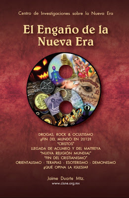

Está en marcha un enorme y diabólico plan para desaparecer de la faz de la Tierra la **fe en Dios** Uno y Trino. ¡No es un mito!  

Ese proyecto, llamado Nueva Era o “conspiración de Acuario” –diseñado por el Instituto Tavistock de Gran Bretaña, financiado por los Rockefeller y puesto en marcha por la CIA desde hace 50 años atrás con la finalidad de neutralizar la amenaza comunista en Estados Unidos y Europa (vía LSD, rock y ocultismo entre la juentud)— continúa hoy con gran fuerza pero ahora a una escala global a través de **TV, libros, revistas, internet, películas, caricaturas, música, medicina alternativa, terapias orientales, yoguis, brujos, santeros, líderes políticos y de opinión, ONU, ONG’s, grupos esotéricos y satánicos**… sin que, “nada” ni “nadie” opongan resistencia.  

 

Así, el movimiento New Age ha obtenido para sí importantes logros y camina sin dificultades hacia su éxito final: La instauración de una “religión única” bajo el Maitreya, la construcción de un Nuevo Orden Mundial y ¡la destrucción de la Iglesia Católica!

A menos que usted y yo seamos conscientes de su existencia, renunciemos a sus tesis y prácticas heréticas, nos convirtamos a nuestro Señor Jesucristo y conformemos en su Cuerpo Místico un fiel “ejército espiritual” para evitarlo y con María Santísima al frente, el misterio de la iniquidad triunfará. ¿Dejaremos que eso suceda?  

En este Año de la Fe (2012-2013) la invitación del Papa es clara: Renovar nuestra misión eclesial y ¡volver a la santidad!

En esta gigantesca guerra apocalíptica del siglo XXI por la perdición y Salvación de las almas no se admiten tibiezas ni neutralidades; Dijo Cristo: “El que no está conmigo, está contra mi…” y “no todo aquél que diga ‘Señor’, ‘Señor’ se salvará…”

¿De qué lado está usted? ¿Qué piensa hacer ahora al respecto?

*Licenciado en Relaciones Internacionales. Maestro y Consultor en Imagen Pública (SIGNUMS). Investigador socio-político. Catedrático de Opinión Pública. Conferencista. Predicador católico. Conductor de radiochronos.com Autor de tres libros. Director del Centro de Investigaciones Sobre la Nueva Era (CISNE).*  

