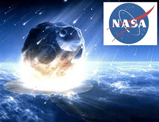

# Niegan el gobierno de EEUU y la NASA el fin del mundo el 21-12-12
El 21 de diciembre no será el fin del mundo. Eso han manifestado el Gobierno de EE UU y la NASA, en contra de las predicciones mayas sobre el impacto del ficticio planeta Nibiru contra la Tierra, ante el bombardeo de consultas de los ciudadanos.  

Primero fueron los científicos de la NASA los que respondieron, tras recibir las más de 5.000 consultas relacionadas con el tema, en su blog Ask an astrobiologist (Pregúntale a un astrobiólogo) y en el apartado de su página web titulado Beyond 2012: [Why the World Won't End](http://www.nasa.gov/topics/earth/features/2012.html) (Más allá de 2012: Por qué el mundo no terminará).

Tras ello, el Gobierno de EE UU desmintió también que el mundo vaya a acabar el 21 de diciembre "o cualquier día de 2012", según indicó en la página web USA.gov en la que responde a ruegos y preguntas de los ciudadanos.  

   

A pesar de que los científicos ya lo habían indicado, algunos ciudadanos han querido recurrir hasta las más altas instancias para saber si la predicción del calendario maya -mal entendida por algunos según apuntan los científicos- es cierta.

"Muchos de esos rumores indican que el calendario maya termina en 2012 (no pasará), un cometa que causa efectos catastróficos (definitivamente no), un planeta oculto acechando que choca con nosotros (no y no), y muchos otros", indica el gobierno.

No habrá catástrofes, ni un meteorito acabará con la Tierra, ni un planeta escondido que no se había detectado hasta ahora, aseguró el Gobierno, son solo "falsos rumores" alimentadas en internet.  

Leer más en: <http://www.20minutos.es/noticia/1666785/0/nasa-profecia-maya/fin-mundo/cinco-mil-consultas/>