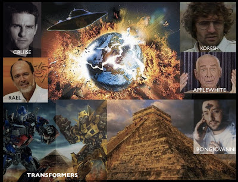

# 21-12-12 ¿Fin del mundo o inicio simbólico de la Nueva Era?
**Ante la creciente y preocupante psicosis** registrada en varias partes del mundo sobre la probabilidad de una catástrofe planetaria el 21 de diciembre próximo -negada por la NASA, el gobierno de Washington y el Vaticano en las últimas semanas-, evento basado supuestamente en las llamadas "profecías mayas", el CISNE niega que esto vaya a ocurrir y apunta, más bien, que se trata del arranque simbólico u oficial de la Nueva Era (el fin astrológico de la era de Piscis y el comienzo de la época de Acuario), largamente pregonada por grupos esotéricos y ocultistas.  

Con objeto de comprender mejor este fenómeno postmoderno, despejar dudas y apaciguar los ánimos, reproduzco a continuación un largo fragmento del libro **"El Engaño de la Nueva Era"** (México, 2012, pags. 32-40). Solicitamos compartir esta investigación.  

   

Algunos new agers, como Mario de Sabato, dicen que la Nueva Era inició “con toda exactitud desde fines de los años ‘80”; Conny Méndez (autora de Metafísica 4 en 1) asegura fue en 1954; S. Raynaud de la Ferriere (fundador de la Gran Fraternidad Universal) aseguró que comenzó en 1948; para otros, arrancó en 1962 (cuando la Tierra entró en la constelación de Acuario y sobrevivimos a la “guerra de los misiles”) y otros más señalan principió en el año 2000 o se dará en este tercer milenio. El esotérico Paul Le Cour publicó un libro en 1937 en el que explicó que sería en el año 2160 cuando la humanidad habría dejado, precisamente, la era de “piscis”.  

Aunque existe, como vemos, un debate entre sus adeptos respecto al año del comienzo astrológico de Acuario, la mayoría de estos coinciden hoy que estamos por dejar atrás dicha “era de Piscis” e iniciar pronto el “despertar global”, la “iluminación universal” o un “cambio espiritual” en 2012 o 2013, en concordancia con las antiguas “profecías mayas”.
Recojo de un sitio web titulado “El Sexto Sol”, la segunda de, según, siete “profecías mayas”:
> “el 22 de Diciembre 2012 el Sol recibirá un rayo sincronizador del centro de la galaxia con el que la humanidad iniciará un nuevo ciclo   galáctico. Como consecuencia de dicho rayo, iniciará el fin del mundo de materialismo y destrucción en que vivimos e iniciará una nueva etapa de respeto y armonía. Antes de ese día, la humanidad deberá optar entre desaparecer como especie pensante que atenta contra el planeta o evolucionar hacia una nueva Era de integración con el resto del Universo”.

Al respecto, especialistas han aclarado que la sexta y última estela del calendario de la cultura maya, conocida como monumento 6 y encontrada por el poeta Carlos Pellicer en el cerro El Tortuguero, en el municipio de Macuspana, en 1958, no anuncia el fin del mundo ni el comienzo de una nueva era a partir del 23 de diciembre de 2012, como se especula en distintas partes del orbe. Y el delegado del Instituto Nacional de Antropología e Historia (INAH), Juan Antonio Ferrer Aguilar, explicó que la piedra hace mención a los combates, victorias y otros sucesos vividos por el gobernante Balam Ahau en el siglo VII d.C. En una de las partes conservadas, apuntó, se alude a la fecha y el polémico descenso de Bolom Yokté, dios de los nueve pasos, asociado con la creación del universo y quien anuncia una nueva era.

Lo anterior me recuerda la "aldea apocalíptica" que un grupo de italianos edificó al sur de Yucatán, México, "contra eventuales catástrofes naturales, como incendios e inundaciones" bajo la creencia de que algo pudiera pasar en 2012 “según la profecía maya”.  

Pero el 22 de diciembre de 2012 no se acabará el mundo ni ocurrirá una catástrofe; tampoco existe alguna profecía maya al respecto, como se ha divulgado por medio de afirmaciones sin sustento científico, advierten especialistas del Centro de Estudios Mayas (CEM) del Instituto de Investigaciones Filológicas (IIFl) de la UNAM. La nota informativa que da cuenta de estas afirmaciones dice textualmente:
“María del Carmen Valverde Valdés, coordinadora del CEM, aclaró que en su calendario los mayas no describieron una profecía, sino el término de un ciclo de 13 bactunes, equivalentes a cinco mil 125 años, y el inicio de otra etapa.
“Un bactún es una unidad de tiempo maya equivalente a 144 mil días del calendario occidental; multiplicada por 13 bactunes, esa cifra arroja un ciclo de cinco mil 125 años, que concluirá el 22 de diciembre de 2012.
“Entonces, acabará un período y comenzará otro, sin que ningún glifo se refiera al fin del mundo o de la humanidad. No existe nada así en las inscripciones de esa cultura, precisó por su parte Tomás Pérez Suárez, también investigador del CEM.
“El 22 de diciembre de 2012 en el ciclo calendárico maya terminará un ciclo de cinco mil 125 años y comenzará uno nuevo, pero en ninguna inscripción se menciona que vaya a ser el fin del mundo, reiteró el arqueólogo.
“Si se cierra una etapa de 13 bactunes, inicia otra igual, y es lo único que va a suceder; los mayas jamás hablaron del Apocalipsis, de destrucción ni de cataclismo.
“Valverde Valdés señaló que esa cultura tenía una noción circular del tiempo, lo que significa que la historia en algún momento se repetirá, explicó la también historiadora y doctora en Estudios Mesoamericanos.
“Para ellos, cuando se escriben los anales se hace una profecía, pues es una concepción cíclica donde los hechos se repiten; si se habla de sus vaticinios, en realidad se trata de lo que registraron de su propia historia, en una forma de escritura -la del maya yucateco- que es siempre críptica y simbólica, precisó.
“El calendario maya se ha estudiado y descifrado desde finales del siglo XIX, entonces, se comenzó a desarrollar una analogía de las fechas de los calendarios maya y occidental. "En esa correlación hay varias discrepancias entre investigadores, que van de días hasta años", indicó.

Como vemos, el llamado “fin del mundo” es un tema recurrente cada vez que inicia o termina un nuevo siglo, milenio o década; es calculado, defendido y promovido principalmente por sectas protestantes de sesgo apocalíptico y ciertos grupos New Age que tienen, más bien, una visión catastrofista o desesperanzadora del futuro próximo. Es usado igualmente como pretexto para fundar grupos, asociaciones o movimientos pseudoespirituales o religiosos cuyos líderes, autonombrados "salvadores", han terminado por traicionar su propia causa y abusado de sus propios miembros.

Existen innumerables casos de líderes sectarios que se creyeron salvadores y presagiaron “el fin”. Algunos ejemplos:

+ **William Miller**, profetizó el fin del mundo para 1843. A pesar del error del líder adventista, sus seguidores lo continuaron imitando.
+ **Charles Taze Russell** fundador de los Testigos de Jehová se autonombró pastor y anunció la venida de Cristo para 1914, pero luego la cambió para 1915 y de nuevo para 1918.
+ **David Koresh** (líder de la secta de los davidianos) en 1993 se inmoló con sus 54 fieles adultos tras enfrentar con armas de alto poder a la policía en el rancho de Waco, Texas. Creía ser la “reencarnación del Mesías”; tuvo 21 hijos con sus mujeres.
+ **Harold Camping** en 2011 el pastor cristiano aseguró en su programa Radio Family de California -y lo reiteró a CNN- que un "terrible terremoto" comenzaría el 21 de mayo y, luego de 153 días tras una serie de eventos, el orbe eventualmente se destruiría el 21 de octubre del 2011. Ya había "profetizado" el “fin” en 1994.

Nuestra postura como católicos sobre el “fin del mundo” debe partir de las siguientes consideraciones:
1. No es posible establecer una fecha específica sobre ese tan llevado y traido discurso del “fin del mundo”.
2. No es lo mismo “fin del mundo” que el “fin de los tiempos” o “últimos tiempos” (que ya estamos viviendo).
3. Jesús en el Evangelio de San Mateo (Capítulo 24, versículo 3), señala los sucesos que habrán de suceder en los “últimos tiempos”: falsos cristos, guerras, escasez de alimentos, grandes terremotos, falsos profetas, aumento de la maldad en el mundo. El profeta Daniel y los cuatro evangelistas señalan, además, que habrá una “Gran Tribulación”, “cual no la hubo desde el principio del mundo” (Mt 24,15). Y el apóstol san Juan indica en el Apocalipsis, menciona la aparición en este tiempo del “Anticristo” (que el Catecismo de la Iglesia Católica, por cierto, reconoce en el numeral 675) en cuyo gobierno habrá una “impostura religiosa”. En fin...

4. Los católicos que creemos por la Fe que Jesús, el Hijo de Dios, habrá de venir con gran poder y majestad a juzgar al mundo y a establecer su Reino de Justicia y Amor, hablamos más bien de la Parusía (que significa manifestación y trata de la segunda venida triunfal de Cristo). El teólogo católico e internacionalista José Alberto Villasana, por ejemplo, en su libro Parusía: el inminente retorno de Cristo afirma que Jesús vendrá para realizar tres cosas:
    * Derrotar al “Anticristo”, así como al “falso profeta” (¿el Maitreya?) y a quienes impusieron un Gobierno Mundial anticristiano; 
    * juzgar a las naciones y llevar a cabo la primera resurrección
    * restaurar la creación y elevar la naturaleza humana en su integridad. [Ver](www.ultimostiempos.org)
5. Por tanto, como podemos apreciar, aunque no es posible asegurar cuándo sucederán estas cosas, el Evangelio sí nos da pistas ("signos") sobre el comienzo y “fin del mundo”.
6. Como fieles católicos debemos estar atentos a estos acontecimientos, en oración constante, alegres y con esperanza, porque el regreso de nuestro Salvador, Redentor, Liberador, sucederá. Cristo escucha la llamada de auxilio de su esposa (la Iglesia) cuando -en medio de tanta perversidad y oscuridad- toda ella clama: Maranatha (“Ven Señor Jesús”) o “Cristo, Rey nuestro: venga tu Reino”.
Al respecto de cuándo comenzará entonces la Nueva Era, el Papa Juan Pablo II aseguró, al refutar esta cosmovisión, que para los cristianos la verdadera nueva era inició con el nacimiento de Nuestro Señor Jesucristo.
Ya dedicaremos un apartado al final de la obra para conocer la opinión oficial de la Iglesia Católica al respecto.

### Extraterrestres: ¿nuestros salvadores?
¿Ha notado que hay películas como Indiana Jones, ET, Transformers o 2012 (esta última protagonizada por John Cusack) donde los alienígenas “buenos” vienen a salvar a la Humanidad? Sí, resultan ser amigos lejanos pero dispuestos, incluso, a proteger al hombre de sí mismo. Claro que hay otras tantas cintas de Hollywood donde los extraterrestres, por el contrario, son perversos e intentan aniquilarnos sin piedad para apropiarse de la Tierra: Independence Day, Marcianos al ataque, Invasión extraterrestre, La Guerra de los Mundos, entre otras.  

Déjeme darle tres ejemplos reales, no de ciencia ficción, en donde ciertos individuos buscan ese “contacto extraterrestre” para salvarnos que rayan, definitivamente, en el absurdo:  

1. **Marshall Applewhite** (de la secta Heaven's Gate = Puerta del Cielo), quien en 1997 se suicidó con sus 39 adeptos porque consideraba que su cuerpo espiritual se salvaría de la destrucción total y abordarían, así, la nave extraterrestre que viajaba detrás del cometa Hale-Bopp que los rescataría.
2. **Rael** (Claude Vorilhon, ex periodista francés y fundador de la secta de los raelianos) quien mezcla religión, pseudociencia y creencia en OVNI's, está actualmente buscando clonar a Cristo para “salvarnos”; para ello tomaría parte de su sangre de la Sabana Santa a fin de “reencarnarlo”). ¿Cómo ve?
3. **Giorgio Bongiovanni**, estigmatizado y falso profeta que asegura recibir mensajes del “ángel” *Setun Sheran*, un extraterrestre. Dice que estos son buenos, ángeles de Dios y existe una “Confederación Interestelar”. Un ejemplo de su discurso:
    *Ashtar Sheran es aquel que en vuestra Biblia llamáis arcángel Miguel y es el comandante general de todas las civilizaciones extraterrestres que visitan la Tierra. Es un Ser de Luz perteneciente a la sexta dimensión, un arcángel. Setun Sheran es un Ser de Luz que pertenece a la 5ª dimensión, es lugarteniente de Ashtar Sheran. Ellos no son físicos, son de luz pero no son entidades espectrales, tienen el espíritu encarnado en un cuerpo de luz que nosotros no podemos ver, llamémoslo cuerpo etérico-astral que les permite hacer cosas que para nosotros son inconcebible*

Como vemos, este señor revuelve la doctrina católica con conceptos esotéricos y New Age. Habla respetuosamente de Cristo, pero no sigue su Evangelio ni vive conforme a su doctrina.
Sin embargo, cada vez cobra más fuerza información relativa al próximo avistamiento mundial de “seres animados” (no son los Muppets) los cuales anunciarían su aparición pública mundial; esto es, no sólo permitirían ser vistos aterrizar en la superficie terrestre sino que entablarían comunicación directa con el hombre y hasta se integrarían a nuestra sociedad. Hay infinidad de versiones y teorías sobre su naturaleza y propósito, que francamente subsiste en más de uno la duda acerca de la veracidad o falsedad del fenómeno OVNI.

Más allá de las historias de *Jaime Maussan* en Tercer Milenio, de los inverosímiles mensajes celestiales dados a Bongiovanni, de los crop circles (marcas esotéricas en los campos de trigo) o de la existencia de los reptilianos (supuestos híbridos: hijos de humanos y aliens, o bien, de demonios y personas), el CISNE seguirá investigando de forma permanente este tema y emitirá una opinión definitiva cuando considere que está listo para hacerlo, en aras de la prudencia y objetividad.

Por ahora la hipótesis relativa a que los extraterrestres son, más bien, ángeles caídos, forma parte relevante de nuestras líneas de investigación. A reserva de confirmarlo no lo descarte tampoco; el Maligno puede hacer cualquier cosa para engañarnos.
Relacionado o no con lo anterior, es posible observar en el cielo cada vez más “estrellas” o luces de colores, muy resplandecientes y fuera de lo común. Ciertamente que muchas de estas cosas pueden ser producto de nuestra imaginación, pero descartando esto, como fotos y videos truqueados, sugiero tener cuidado en las interpretaciones que se hacen de los mismos. Por ejemplo, gente del Maitreya ha dicho que se trata de “señales” de su próximo advenimiento. ¿Será que quieren confundirnos con “las grandes señales en el cielo…” y con “los astros se conmoverán” que leemos en el discurso escatológico de Nuestro Señor, signos de su retorno y de nuestra liberación? (Mateo 24, 29-30).

### Portal dimensional 12:12
Hemos detectado que en México diferentes grupos esotéricos y ocultistas, practicantes por ejemplo del método Theta Healing (más adelante aquí descrito) pretenden “abrir un portal dimensional 12:12” en diciembre de 2012; se trata, bajo esta creencia, de “puertas” ubicadas en distintas partes del mundo –como en sitios arqueológicos- que habrían sido vistas y conducirían a otros sistemas solares (Sirio, Pléyades, Arcturus, etc.). Hay quienes señalan, como Bongiovanni, que fueron creados por los propios extraterrestres.
Los brujos o chamanes creen en estos “puertos” o “conexiones multidimensionales” que se abren o se cierran en distintos lugares y épocas del año, y otros indican que son “cilindros de luz” que “permiten el ingreso de la Nueva Energía con patrones y códigos estelares provenientes del Sol Central de la Galaxia”. ¡Vaya consideración!
¿Y para qué desean abrir esos supuestos portales?
Estas mismas personas señalan que con el objetivo de prepararnos para el “segundo amanecer”, para la llegada de “Acuario” y para invocar a “dioses alienígenas” o a “entidades” tales como Saint Germain, Ashtar Sheran, Metatrón, entre otros. ¿Puede creerlo?
Lo anterior me recuerda la película de Los Vengadores, en la cual el villano Loki (hermano de Thor) pretende abrir un portal a Asgard para que dioses malos invadan y destruyan la Tierra. Para ello, hace uso del cubo de energía llamado Tesseract que robó al equipo S.H.I.E.L.D., y los superhéroes intentan recuperar. Es curiosa la analogía, ¿no cree?
En realidad se trata de una convocatoria espiritista masiva y sumamente peligrosa, pues en realidad lo que hacen con eso es invocar –a sabiendas o por ignorancia- ¡a legiones de espíritus malignos!
Debemos orar a Dios a fin de que, con portales o sin estos, evite que este tipo de actos se promuevan aún más y, principalmente, no tengan consecuencias espirituales para nosotros.  

### La Era de Acuario no es el “Gran Aviso de Dios”
Ahora bien, es importante aclarar que el inicio de la era de Acuario no es, en lo absoluto, el Aviso de Dios (llamado también “Advertencia” o “Juicio en Pequeño”) como de manera mañosa pretenden asociar gurúes, esotéricos o “maestros” espirituales a este importante evento. Me explicaré.
De acuerdo con la revelación privada mariana en Garabandal, España (entre 1961-1965) –que no es materia de fe, es decir, no obligan al católico a creerlas para su salvación—Dios, por su infinita Misericordia, hará que todos experimentemos, por un momento, una luz poderosa del Espíritu Santo en nuestra conciencia; es decir, cada persona vería en su propia conciencia sus pecados y ofensas hechas a Dios. Este Aviso, ciertamente tremendo, sería una oportunidad especial del Padre para toda la Humanidad a fin de modificar nuestra conducta, arrepentirnos de corazón y convertirnos completamente a Nuestro Señor. A este acontecimiento se le ha dado en llamar, también, “segundo Pentecostés”.
Nadie sabe cuándo tendrá lugar este acontecimiento extraordinario, de ser cierto que ocurrirá, pero ya parte del movimiento New Age afirma que así será y se trata de la “iluminación universal” que dará lugar al cambio de eras (Acuario por Piscis). En otras palabras, informados de este llamado de Dios sus miembros negarán que el Aviso venga de Él y lo atribuirán, más bien, al realineamiento de los astros (bajo interpretación astrológica) y será una señal, patente, del emerger de Maitreya en el mundo.
La trampa global ya está preparada y sólo es cuestión de que se cumplan los tiempos estipulados para su realización.
Las preguntas hoy son:
¿Cuántos millones de personas habrán de ser engañadas por el falso mesías? Y, ¿cuántos seremos capaces de resistir sus insidias y blasfemias?

