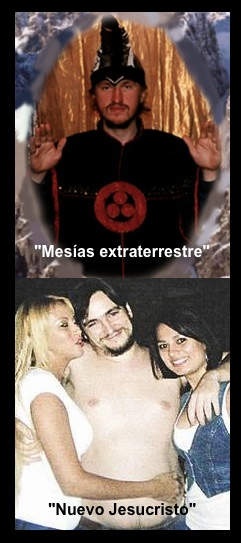

Tras sobrevivir al "fin del mundo" el pasado 21-12-12 y a la colisión ayer del asteroide "2012 DA14", los terrícolas y católicos no paramos de sorprendernos por la vasta imaginación que para el fraude algunos "iluminados" o lunáticos emplean para manipular a la gente.

Me refiero a los casos recientes, registrados en las últimas semanas, en los cuales observamos como común denominador: La usurpación del nombre de Cristo, el empleo de métodos de "lavado de cerebro" psicológico, la avaricia de grupos sectarios, abusos sexual en las "iniciadas" y la detención de miembros y líderes afines al movimiento New Age. ¿Algo más?

## 1. "Mesías extraterrestre"
Conocido también como el "extraterrestre de Sirius", **Konstantín Rudnev** fue detenido, juzgado y condenado el pasado 7 de febrero por las autoridades de Rusia a 11 años de prisión por atentar contra la integridad de sus adeptos, abuso sexual y tráfico de drogas.

Rudnev fundó la secta **"Ashram Shambala"** en 1989 y se creía el "salvador del mundo". Según la agencia de noticias RIA Novost, reclutaba a sus seguidores en clases de yoga, donde la mayoría eran jóvenes entre los 18 y 30 años de edad. Logró reunir en más de dos décadas entre 10 mil y 30 mil personas. Practicaban orgías. Asimismo, abrían escuelas de masaje erótico, de danza y yoga.

Un dato curioso adicional: El tal "mesías" luce en su atuendo tres puntos rojos, cuyo diseño es el mismo que usa la llamada **"bandera de la paz"** (ONG de la ONU), "símbolo Universal que representa la Unidad en la Diversidad para lograr un mundo mejor". ¿Qué le parece? Suena a broma, ¿no? Su origen viene de Nicolás Roerich (quien sus esposa Helena fue la primera traductora del libro La Doctrina Secreta de la rusa oculista **M. Blatavsky**). Tristemente grupos Scouts promueven este mismo logotipo.

Pues la competencia en el mercado de la sectas post soviéticas y apocalípticas está dura: Recordemos que ya existe un tipo llamado **"Visarion"** (era policía, le fue mal en la chamba) y hoy es el "Cristo siberiano". Sus seguidores celebran el día de su cumpleaños como la "Navidad", en enero.  

 

## 2. El “nuevo Jesucristo"
El fundador de los **“Defensores de Cristo”**, Ignacio González de Arriba (sic), fue capturado con sus cómplices el 25 de enero por la policía luego de haber sido denunciado por “Ariel” (nombre ficticio de una ex adepta) ante la Fiscalía Especializada en Delitos contra ls Mujeres y Trata de Personas (Fevimtra) de la PGR.  

Fue acusado de haber comotido abusos sexuales, robos, fraudes. Llegó a obligar a sus seguidoras a comer vísceras de animales con la promesa de alcanzar milagros.

La secta operaba en Coahuila, Tamaulipas y Nuevo León, en México y llegó a reunir a cerca de 10 mil seguidores en países como Argentina, Colombia y Perú.

“Ariel” brinda el siguiente relato, como publicó el diario Vanguardia:  

“Fue Ignacio González de Arriba, quien introdujo la religión al Centro de Bioprogramación que instaló con su esposo, el venezolano José Losanger Arenas Segovia, en 2007, primero en la colonia Paseo de la Rosita, después en el centro de Torreón. Apoyado siempre de Arenas Segovia, y Shoucri Elmernessi, crearon una red de adeptos que se expandió a través de Internet en distintos lugares de Latinoamérica, hasta acumular cerca de 10.000 seguidores en países como Argentina, Colombia y Perú, según explicó Olivia Castillo, otra de las denunciantes.

“¡Claro que nos hacían acostarnos entre mujeres!”, denunció, “él decía que dentro de sus preceptos estaba permitida la poligamia, pero solo de hombres. Las mujeres tenían que ser bisexuales. Ellos podían verte, más no tocarte. Ignacio disfrutaba viendo orgías de mujeres”. Defensores de Cristo prometía la vida eterna, riquezas y el don de hacer milagros, porque aseguraban que Ignacio González había muerto y resucitado; en España se hacía llamar Maestro Fénix.

“González les decía que necesitaba tener sexo con tres mujeres al día, pues eso le daba magia, razón por la que pedía a sus seguidoras tener relaciones con él, o que le consiguiera prostitutas. “Papá Dios me dijo que promovamos la poligamia como algo bendito a los ojos de Dios, y la riqueza económica como algo importante”, argumentaba el hombre actualmente detenido.”

Como puede usted apreciar, estos casos y muchos más son pruebas evidentes del terrible peligro que el movimiento **New Age** representa para la sociedad actual. Por ende, requiere ser investigado y denunciado por sus trampas, errores y falacias, a fin de prevenir tanto daño y dolor.

No puedo dejar de advertir, también, la profunda ignorancia, sumisión y candidez de aquellas personas que fueron víctimas de timadores e impostores "profesionales", lo cual denota la necesidad urgente, una vez más, de impulsar la Nueva Evangelización -con la fe y la razón- a todo el orbe.

Una buena formación cristiana actúa como blindaje y antídoto eficaz contra este tipo de abusos.

<http://www.CISNE.org.mx>