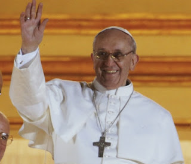

# S.S. Francisco: Un nuevo Papa para la Nueva Evangelización

**El Centro de Investigaciones sobre la Nueva Era (CISNE)** se une al gozo de todos los católicos por la designación de Jorge Mario Bergolio, SJ, Arzobispo de Argentina, como el nuevo Papa de la Iglesia Católica.

Rezamos todos a Dios y a la Virgen porque su sabio gobierno terrenal y espiritual sean un viento fresco e impulso vigoroso en el cumplimiento de la misión de llevar el Evangelio de Nuestro Señor Jesucristo a todos los pueblos del orbe, especialmente en este Año de la Fe.

  

### ¿Quién es el nuevo sucesor de Pedro?
<http://www.aciprensa.com/noticias/quien-es-el-papa-francisco-i-79430/#.UUOBrL_OV2c>

### Su primera Misa (video y texto):
<http://www.aciprensa.com/noticias/video-y-texto-completo-primera-homilia-del-papa-francisco-con-los-cardenales-en-la-capilla-sixtina-37709/#.UUOB3L_OV2c>

### Vaticano rechaza campaña de calumnias contra el Papa:
<http://www.aciprensa.com/noticias/vaticano-rechaza-campana-contra-el-papa-francisco-en-argentina-50711/#.UUOCK7_OV2c>