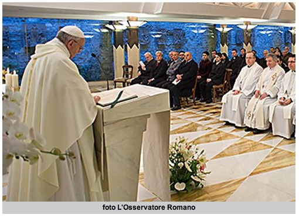

# Nos nos salvan las brujas, el tarot o nosotros mismos: Papa Francisco

El pasado viernes, el Papa Francisco dijo en su homilía de la Misa, en la Casa Santa Marta en el Vaticano, que ni en las brujas, el taro o nosotros mismos está la salvación, sino solamente en Jesús.

Ver nota completa en:
<http://www.aciprensa.com/noticias/francisco-no-nos-salvan-las-brujas-el-tarot-o-nosotros-mismos-solo-jesus-39702/#.UWGy37_OV2d>

Hoy, los católicos celebramos el Día del Señor de la Misericordia.

  

¿Qué es la fiesta de la Misericordia? <http://mercedes-elseordelamisericordia.blogspot.mx>

**¡Que Dios tenga piedad de nuestros pecados de idolatría, paganismo y ocultismo que van contra su Primer Mandamiento!**
*Fuente: Aciprensa (EWTN)*