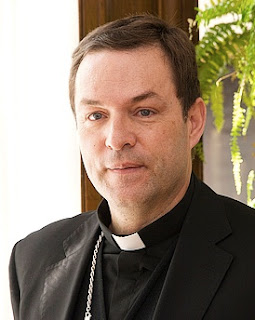

# ¿Qué es la Nueva Era?
Un gran reto actual para la Iglesia: una nueva forma de espiritualidad, de mística, de relación con lo divino. Responde a esta importante cuestión monseñor **Raúl Berzosa**, obispo de Ciudad Rodrigo, en el portal católico [Aleteia](https://es.aleteia.org/).

# 1. La Nueva Era es un fenómeno propio del siglo XX, la explosión de un nuevo tipo de espiritualidad.

La New Age nace como una especie de sensibilidad “epocal”, principalmente en los países y naciones de los llamados primeros mundos. Cuando se tiene el estómago lleno, hay que llenar también la cabeza y el corazón. Este nuevo fenómeno aflora como un gran pulpo, con tentáculos en todos los ámbitos culturales, pero al que es muy difícil descubrir los ojos y el cerebro.

  

¿Por qué se denomina al New Age también como **“Era de Acuario”**? - Porque nos encontraríamos casi al final de un ciclo astronómico (Piscis) e inicio de otro (Acuario). Hubo un tiempo en el que se vivió bajo el signo de Tauro, y aparecieron los imperios y religiones de Mesopotamia. Vino después Aries, y floreció la religión judía. El signo de Piscis, que comenzó su reinado el 21 de marzo del primer año de nuestra era, ha sido denominado “crístico” (IXCIS). Hacia el año 2016 el sol entrará en el signo de Acuario, y este signo traerá consigo una nueva religiosidad mundial capaz de reconciliar todas las demás religiones. Acuario va a suponer un nuevo orden mundial, una humanidad nueva , y una nueva religión. La New Age comportará una era de amor, concordia y luz, de verdadera liberación del espíritu. Se habla del retorno de un nuevo Cristo: no el histórico Jesús de Nazaret, sino de **Maitreya**.

La New Age (la “Era Acuario”) constituye una verdadera bomba de relojería para las religiones. Porque no se trata sólo de una religión más, ni de un nuevo movimiento o una nueva secta. Es una completa “gnosis”, o visión integral de la realidad. Y, lo que es más grave, no se enfrenta con el cristianismo, ni con las religiones en general, sino que se instala en ellos; e incluso utilizando su mismo lenguaje, su misma espiritualidad y sus mismos símbolos, les da un sentido completamente diferente.

*Leer más en: Red Iberoamericana de Estudio de las Sectas (RIES):*
<http://infocatolica.com/blog/infories.php/1304031202-aleteia-ique-es-la-nueva-era#more19820>
