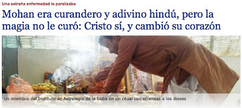

# Conversión de curandero y adivino hindú; Cristo lo cura de extraña enfermedad
La revista de evangelización *"Vachanolsavam"*, de los religiosos vicencianos de la India, recoge a veces historias que nos recuerdan las que leemos en Hechos de los Apóstoles, e incluso más asombrosas, pero ambientadas en nuestra época: personas que viven en el paganismo y a las que Cristo impacta.  

  

Una de estas historias es la de Mohan Prasad, un curandero y astrólogo titulado y miembro "de toda la vida" del Consejo Indio de Ciencias Astrológicas <https://www.icas.org.in>, que fomenta la astrología védica como adivinación, terapia y modo de vida, enraizada en los textos sagrados del hinduismo (los Vedas) y que en pleno siglo XXI ha crecido enormemente (de 3.000 socios en 1999 a más de 10.000 en la actualidad).  
[Lea aqui](https://www.religionenlibertad.com/personajes/29071/mohan-era-curandero-y-adivino-hindu-pero-la-magia-no-le.html)  

**P. J. G. /ReL**