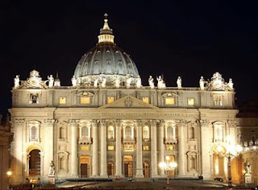

# El Vaticano estudia los nuevos movimientos religiosos

“El jueves 16 de mayo, en la Casa Santa Marta del Vaticano, tuvo lugar una Consulta sobre los **Nuevos Movimientos Religiosos**, organizada por el **Consejo Pontificio para el Diálogo Interreligioso**. El fin de tal iniciativa fue ofrecer una oportunidad para profundizar en una temática que merece atención y reflexión. Los participantes, unos cuarenta, representaban a varios dicasterios vaticanos, universidades pontificias, la Conferencia Episcopal Italiana y el Vicariato de Roma”.

Uno de los temas que se abordaron en el encuentro fue **“El fenómeno de la New Age”**, cuya reflexión estuvo al cargo de don Alessandro Olivieri Pennesi, responsable de la Oficina para los Nuevos Cultos del Vicariato de Roma.
 

Como se recordará, este Consejo Pontificio y el Consejo Pontificio para la Cultura publicaron en 2003 el informe "JESUCRISTO, PORTADOR DEL AGUA DE LA VIDA. Una reflexión cristiana sobre la Nueva Era", bajo el papado de S.S. Juan Pablo II.

*Fuente:  Zenit.org*