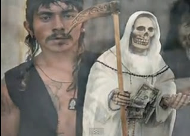

# La "santa muerte", un culto blasfemo del crimen organizado
El cardenal italiano Gianfranco Ravasi, presidente del Consejo Pontificio para la Cultura, declaró ayer, 8 de mayo, que el crimen organizado “es anticultura” y que credos asociados con él, como la **Santa Muerte** en México, son **“blasfemos”**. Lo leemos en una información de Efe y El Universal. “**La criminalidad organizada** no es cultura, es anticultura. Cancela todos los grandes valores de las relaciones sociales, humanas, personales”, dijo Ravasi en una rueda de prensa ofrecida en el Museo Soumaya de Ciudad de México.

 

Leer más [aquí](http://infocatolica.com/blog/infories.php/1305081147-cardenal-ravasi-la-santa-muer).

