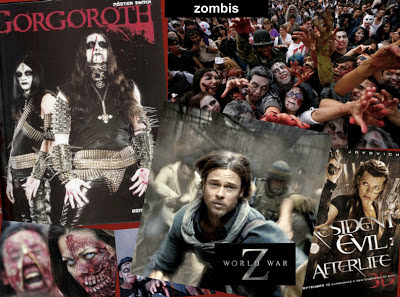

# La invasión de los zombies; ¿la nueva tribu urbana del siglo XXI?
 

Llama poderosamente la atención cómo en el último lustro se ha dado un boom inédito entre la juventud de los llamados zombis o zombies a través de los videojuegos, caricaturas, libros, TV y películas. Así, destacan por su éxito **Resident Evil** (hay 4 cintas con el mismo nombre); **The Walking Dead**, teleserie de AMC; **Marvel Zombies**, cómics, **Dead Rising**, videojugo de XBox y Wii, y el anticipado éxito taquillero del filme **"Guerra Mundial Z",** a estrenarse en junio de 2013, protagonizada por Brad Pitt.

Le doy un dato adicional que expresa claramente el auge del tema: Tan sólo en la industria cinematográfica estamos hablando de ¡más de **77** películas sobre zombies, de 2007 al 2012!

Fue el desaparecido Michael Jackson quien abordó primeramente el asunto en 1982 en su famoso video de la canción y álbum Thriller,  con proyección mundial. Como se recordará, en este él se convierte en un zombie y baila con otros iguales a él, en una extraordinaria coreografía e impactante vestuario.

Pero, **¿por qué tanto interés de los jóvenes en el tema?** ¿Por qué en México, incluso, cada año se lanzan a las calles del centro del D.F. disfrazados para bailar y pretender romper el récord Guinness mundial? (Una nota del diario El Universal da cuenta de más de 30 mil niños, chavos y familias que rompieron su propia marca el 2 de noviembre de 2012 en una caminata y concentración en el Zócalo). Ver la nota aquí.

Considero que este tipo de expresiones -presentes en todos los niveles socioeconómicos en la actualidad- es **una señal de la creciente descomposición social y un síntoma de la crisis de valores** (falta de los mismos, más bien, entre la juventud), donde el **rechazo a lo bello, bueno y estético** (al arte propiamente) se abre paso como una alternativa o escape a los estereotipos tradicionales. Más aún, revela desde mi perspectiva, el estado oscuro del corazón humano, que no conoce a Dios.

Y es que el término zombi o zombie, si bien tiene varias acepciones, tiene como denominador común: el **ocultismo**. Es decir, se trata aparentemente de personas muertas que "cobran vida" o movimiento, pero carecen de voluntad propia, mente y autocontrol.

Pero desde una perspectiva cristiana, **la creencia en los zombies implica una apología al Malo**. Sí, puesto que Satanás no puede dar vida al cuerpo -dado que sólo Dios puede darla esta mediante su rua (soplo divino)- entonces simula que tiene el poder para hacerlo. Al penetrar el cadáver con un demonio y moverlo a su antojo, finge ser capaz de lograr algo que no puede: ¡Dar la vida!

El fenómeno de los zombies en esta sociedad moderna es, en el fondo, una **negación del misterio de la Resurrección de los muertos** que profesamos quienes, por fe, creemos en Cristo (Camino, Verdad y Vida) al resucitarnos en un cuerpo glorioso y, al mismo tiempo, un rechazo abierto y directo del Tentador a lo hermoso y a la vida misma, porque como el ladrón "sólo viene para robar y para matar". (Juan 10, 10-20).

Creer igualmente en la **reencarnación (oriental) en vez de la resurrección** (cristiana), es una bofetada al Señor; va en la misma línea del rechazo al Amor de Dios por el género humano.  