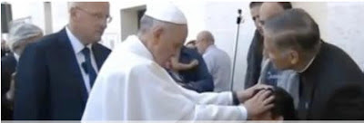

# El 'exorcismo' de Ángel, la acción del Maligno y el mensaje para México
 

El pasado domingo 19 de mayo de 2013, en la festividad de Pentecostés, la prensa internacional dio cuenta de un supuesto exorcismo realizado por el **Papa Francisco** al mexicano **Ángel**, lo cual fue negado al día siguiente por el director de la Oficina de Prensa de la Santa Sede, padre Federico Lombardi, y refutado luego por el Pbro. **Gabriel Amorth**.  

No obstante, más allá de haber sido o no un "exorcismo" realizado por Su Santidad, el tema en el cual debemos centrar nuestra atención es:

- La acción real, patente y extraordinaria hoy del Maligno
- La causa de la posesión demoníaca y terrible sufrimiento del michoacano Ángel: La legalización del aborto en CDMX
- La necesidad urgente de nombrar sacerdotes exorcistas en todas las Diócesis de México.
- El papel de México en la Salvación del mundo, con la Virgen de Guadalupe al frente

Nuestra experiencia de **más de 15 años** de investigaciones documentales y de campo -donde hemos conocido personalmente a cientos de personas con distintos daños físicos, psicológicos y emocionales, buena parte de estos sumamente graves, producto de su incursión en el ocultismo- nos permite afirmar que estamos en medio de una verdadera "guerra espiritual". Los propios **testimonios de ex brujos, ex santeros y ex satánicos** confirman, por una parte, el propósito nefasto del Malo por dañar y matar a las personas y, por la otra, la misericordia y el poder infinito de Dios y de la Virgen al rescatar a sus hijos de las garras de Satanás.  

**Ángel vive un verdadero drama**: La posesión de cuatro demonios desde hace más de 14 años que, pese a más de 30 exorcismos practicados por 10 exorcistas del mundo (entre ellos el Pbro. Amorth), no se van.  

En la siguiente entrevista **el licenciado en Mercadotecnia, padre de familia y de 44 años**, habla de su víacrucis, la reliquia del Padre Pío, su sueño de viajar a Roma y su sensible mejora tras la oración del Papa Francisco: <http://www.religionenlibertad.com/articulo.asp?idarticulo=29417>  

Pero, **¿qué es lo que esta sucediendo con Ángel?** ¿Por qué no puede ser liberado?  

**El Pbro. Juan Rivas**, Legionario de Cristo y quien llevó a Ángel ante el Papa, da la respuesta al indicar:
*"Es un buen chico, ha sido elegido por el Señor para mandar un mensaje al clero mexicano y decirle a los obispos que tienen que hacer un acto en reparación por la horrenda ley del aborto aprobada en Ciudad de México en 2007 y que supone un ultraje a la Virgen. Hasta que no lo hagan Ángel no será liberado"*.

Asimismo, es enfático en señalar en una entrevista al respecto del caso algo impactante:
> ...los casos de posesiones se deben en primer lugar al pecado mortal. Con el pecado mortal expulsamos a Dios de nuestra alma y de nuestra casa, que como dice Nuestro Salvador, queda vacía. No podemos vivir en pecado mortal. En el caso del que hablamos, el de Angel y su posesión, está relacionado con el triunfo del Corazón Inmaculado de Maria, prometido en Fátima. Los demonios no pueden hablar contra sí mismos si “La Señora” no les obligara a hacerlo al pisarles la cabeza. Para que este triunfo se realice, México tiene que reconocer su misión de nación privilegiada y volver a la fe de siempre, cuando cantábamos: “¡La Virgen Maria es nuestra protectora, nuestra defensora, a nada hay que temer. Somos cristianos y somos mexicanos: Guerra, guerra contra Lucifer! Lo que pide Nuestra Señora no es nada extraordinario, pero un acto de fe y de reparación. 
El demonio no es un dios poderoso, él ya fue vencido y derrotado por Cristo en la cruz, pero el neo-paganismo, el apagarse de la fe en el mundo actual, y el hecho de que los pastores estén adormecidos, distraídos, favorece su acción. Si las autoridades eclesiásticas corrigen su actitud y denuncian el aborto (y otras manifestaciones del mal) y trabajamos todos por revertir esa ley que promueve la violencia contra los más débiles e indefensos, si se renuncia a Satanás (incluso con un exorcismo del país) y se consagra el país a Maria, el demonio será encadenado y llegará el Triunfo del Corazón Inmaculado de Maria. Esclarezco que eso no es un acto de magia, pero todo un proceso de conversión que comienza desde abajo, en el hogar.

Video de la nota:  
<iframe width="590" height="332" src="https://www.youtube.com/embed/W8oCpgAQLn8" title="YouTube video player" frameborder="0" allow="accelerometer; autoplay; clipboard-write; encrypted-media; gyroscope; picture-in-picture" allowfullscreen></iframe>   

Referencia: <https://www.portaluz.org/p-juan-rivas-nos-revela-el-contenido-de-la-carpeta-que-374.htm>

Hoy no se pregunte usted entonces si el Demonio **existe** -aunque teólogos apóstatas y herejes se empeñen tercamente en negarlo- sino qué tipo de prácticas, rituales, pactos, música sinietra, películas, sacrilegios, etc. ha realizado que generan pecados, infestaciones, obsesiones, compulsiones, posesiones y toda clase de afectaciones a su persona y a su familia. ¿Por qué? ¡Porque peligra su Salvación! 

**Renuncie con fuerza y convicción al Enemigo**, y vaya al confesionario, para convertirse de corazón a Cristo, Nuestro Señor, ¡Rey, Salvador y Liberador!

Por Jaime Duarte Mtz., Director del CISNE.
<https://www.cisne.org.mx>  
*contacto@cisne.org.mx*  
*trampanewage@gmail.com*  