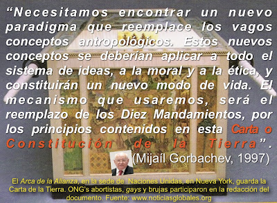

# La Carta de la Tierra y el Arca de la Esperanza ¡contra la Fe!

**¡Alerta! ¡No es un mito!** 

  

El sacerdote católico argentino **Claudio Sanahuja** advierte: Organizaciones No Gubernamentales (ONG's) pretenden, bajo el cobijo de la Organización de las Naciones Unidas, ¡acabar con los Diez Mandamientos!

La Carta de la Tierra, el "Decálogo de la Nueva Era", es un documento de 16 "principios" contenido en la llamada "Arca de la Esperanza" -a modo de parodia del Arca de la Alianza, que contenía las Tablas de la Ley- elaborada por grupos abortivas, izquierdistas, ecologistas, homosexuales, new agers,  y ocultistas. Ello, bajo la idea de impulsar una "nueva ética planetaria", cuyos promotores son los teólogos rebeldes Leonardo Boff y Hans Küng, y quienes impulsan el falso ecumenismo y la instauración de una nueva religión mundial, dada su visión panteísta cuando invocan a Gaia, Bhumi o la Madre Tierra.

Se trata de una prueba más del movimiento Nueva Era por acabar con el cristianismo.

Mas información: <https://es.catholic.net/op/articulos/10591/cat/878/noticias-globales.html#modal>

*Por Jaime Duarte Mtz., Director del CISNE*   
<https://www.cisne.org.mx>

