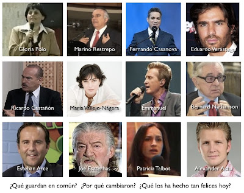

¿Han notado que en los últimos años hemos atestiguado la impactante conversión de figuras públicas y de famosos a Dios?

Médicos, escritores, actores, cantantes, comunicadores, modelos, pastores, mercadólogos... conocidos en su momento por sus pecados de mundanalidad, ateísmo, blasfemias, abortos, protestantismo, gnosticismo, paganismo, frivolidad, materialismo, diversión, lujuria... en fin, por su lejanía y hasta beligerancia contra la religión, la Virgen, lo santo, verdadero y la Iglesia, **¡han regresado a la Fe católica!**

Pero, ¿por qué? ¿Por qué han vuelto a la Casa del Padre? ¿Por qué han abandonado su estilo de vida, incluso la fama, renunciado al Maligno y han regresado contritos al camino de la Salvación? ¿Qué los ha hecho cambiar? ¿Por qué dicen ser hoy más felices y ahora mueven almas y voluntades también para Cristo?  

La respuesta es unánime: ¡El encuentro vivo con su hermoso Amor! El grito angustiante de Dios Misericordioso ha tocado en lo más profundo su mente y corazón les ha dado una fuerza extraordinaria para cambiar, para ser mejores y buscar la santidad. **¡Glorifican a Dios!**

Para mi no hay duda: Hoy, como desde el principio y hasta el fin de los tiempos, la santísima Virgen María y Nuestro Señor Jesucristo siguen seduciendo al hombre, al pecador, sin importar la edad, ideología, nacionalidad o ámbito de procedencia. Es el infinito Amor de Dios que resuena en nuestra consciencia, que sale al encuentro de sus hijos pródigos; un Dios grande y poderoso que de muchas formas y a toda hora nos persigue cada instante de nuestra vida y, aún, mendiga nuestro pobre amor. "¡Oh Señor! Qué es el hombre para que te acuerdes de él?" (Salmo 144, 3-4). Canción: "Si conocieras cómo te amo".  

Como ellos, y muchos más, roguemos la gracia de encontrarnos siempre y personalmente con Cristo, y porque más y más hermanos bautizados regresen a los Brazos del Padre para que Él los sane, los transforme y los libere del Maligno.

  

He aquí algunos testimonios de conversión a Dios Uno y Trino, tras tocar fondo:  

* Gloria Polo (médica colombiana a quien le cayó un rayo).  
* Marino Restrepo (mercadólogo y publicista secuestrado por las FARC).   
* Fernando Casanova (ex pastor pentecostal experto en Sagradas Escrituras).   
* Eduardo Verástegui (actor y productor de cine mexicano).   
* Ricardo Castañón (médico y neurólogo, investigador de milagros eucarísticos).    
* María Vallejo-Nájera (escritora española).   
* Emmanuel (cantante mexicano). Ver [video aquí](http://www.youtube.com/watch?v=MTSwJcrMrc0) sobre su encuentro con Dios, en concierto.
* Bernard Nathanson (+ médico ginecólogo estadounidense; practicó miles de abortos).
* Esteban Arce (conductor mexicano de TV). 
* Joe Eszterhas (escritor estadounidense de películas eróticas en Hollywood).  
* Patricia (Pachi) Talbot (ex modelo profesional ecuatoriana; vidente).   
* Alexander Acha (canta autor mexicano).   

Y muchos más y... los que faltan. ¿Qué esperas para volver a Nuestro Señor? Haz la prueba y lo verás, como la hice yo también.

Católicos: ¡Regresen! Ver video aquí:

<iframe width="560" height="315" src="https://www.youtube.com/embed/RRJaBgCw1Qo" title="YouTube video player" frameborder="0" allow="accelerometer; autoplay; clipboard-write; encrypted-media; gyroscope; picture-in-picture" allowfullscreen></iframe>      

---   

<iframe width="480" height="360" src="https://www.youtube.com/embed/eIIrzkGdKag" title="YouTube video player" frameborder="0" allow="accelerometer; autoplay; clipboard-write; encrypted-media; gyroscope; picture-in-picture" allowfullscreen></iframe>      

---

<iframe width="640" height="480" src="https://www.youtube.com/embed/HOlT3ABK26k" title="YouTube video player" frameborder="0" allow="accelerometer; autoplay; clipboard-write; encrypted-media; gyroscope; picture-in-picture" allowfullscreen></iframe>  

*Jaime Duarte Mtz., Director CISNE*  
*@JaimeDuarte*