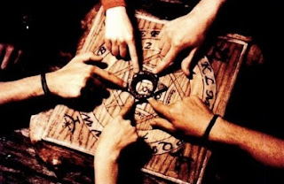

# En Perú alertan del peligro de jugar "ouija" en Halloween

"01:02 PM Lima.- El ministerio de Salud en vísperas del día de las brujas o **Halloween**, hizo una advertencia el jueves sobre los peligros de la **ouija**, un juego de mesa por el cual quienes lo practican **convocan a los espíritus**, y que dijo ha provocado varias atenciones en hospitales por casos de **histeria, esquizofrenia y trastornos sicóticos**.  

"Con ocasión de las fiestas de **Halloween**, generalmente los adolescentes optan por practicar ese juego entrando "en un **trance de exaltación y de distorsión de la realidad** que puede conducir al suicidio, advirtió **Freddy Vásquez, director del Centro de Prevención del Suicidio del hospital Hideyo Noguchi del Ministerio de Salud**, según una nota difundida por el ministerio, informó AP.  

"No se dieron cifras sobre el número de casos registrados en los establecimientos de salud por supuestas **alteraciones mentales** derivadas del juego.

"Vásquez señaló que en el aspecto psiquiátrico, en la **ouija** se conjugan la imaginación, las supersticiones y hasta las películas de terror en la mente de los participantes."