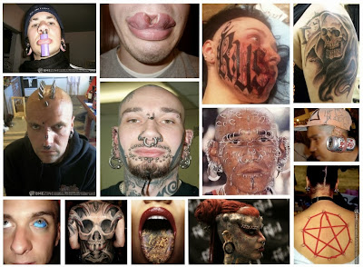

# Tatuajes, piercings y escarificaciones dañan la salud del cuerpo y del espíritu

  

En la siguiente **investigación** explicamos qué son los tatuajes, las perforaciones (piercings) y las escarificaciones, sus tipos, sus símbolos, sus colores, sus significados, los motivos que llevan a los jóvenes a practicarlos, sus riesgos y consecuencias para la salud física y espiritual.

**Si estás pensando en tatuarte o perforarte**, te invitamos a leer antes este artículo completo que estamos seguros te orientará y persuadirá a fin de salvar tu vida. Si ya lo hiciste, considera que tu salud está en riesgo pero aún hay oportunidad de dar marcha atrás en esa desafortunada decisión.

Pese a sus múltiples significados y motivos, este tipo de **"body art"** actual -popular y atractivo- es **altamente peligroso**. Por ejemplo, el Instituto Mexicano del Seguro Social (IMSS) advirtió, desde 2009, que cinco de cada diez jóvenes que se perforan alguna parte del cuerpo tienen infección por bacterias y, de estos últimos, por lo menos tres desarrollan infecciones crónicas, tales como hepatitis y VIH (SIDA). Fuente: Milenio Diario, 3 febrero 2009).  

<iframe class="scribd_iframe_embed" title="Tatuajes y Perforaciones_investigacion" src="https://www.scribd.com/embeds/173968962/content?start_page=1&view_mode=scroll&access_key=key-upu5qqmpvuh61s80hcn" tabindex="0" data-auto-height="true" data-aspect-ratio="0.7729220222793488" scrolling="no" width="100%" height="600" frameborder="0"></iframe>