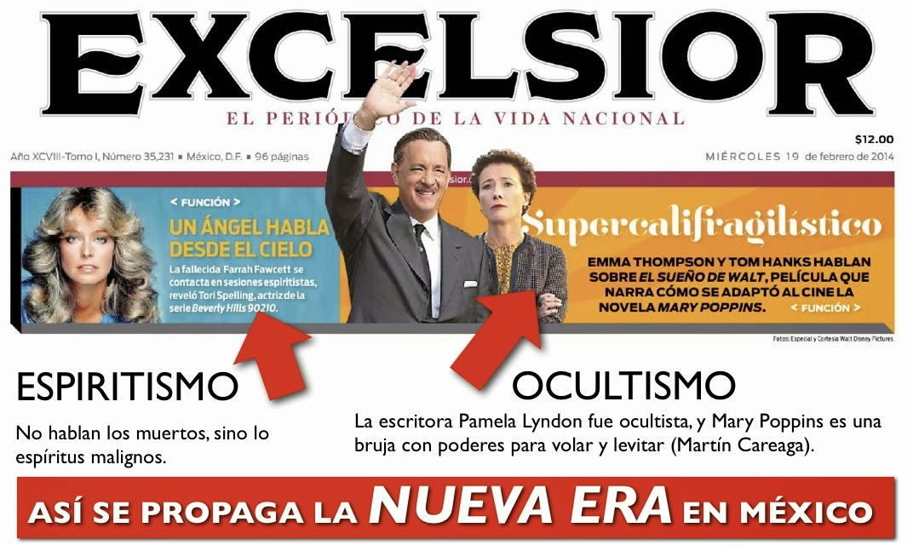

# ¿Regresa el espiritismo? ¡No! Nunca se ha ido
  

El tema viene a cuento porque **el periódico Excélsior** publica en su primera plana dos notas interesantes, pero preocupantes, que evidencian la fuerza y el alcanze del movimiento **Nueva Era**.  

La primera es acerca de que la actriz estadounidense **Tori Spelling** (conocida por su participación en la la serie de los 90's Beverly Hills 90210) señala que la famosa actriz Farrah Fawcett le habló a través de un psiquico cuando deseaba contactar a su padre muerto.

Aquí, en el CISNE, hemos platicado ya antes sobre el tema del **espiritismo (clásico y moderno)** y hemos insistido, con base en la sana doctrina católica, que cuando una persona muere va al Cielo, al Purgatorio o al Infierno según el santo Juicio de Dios (las llamadas "almas errantes" son una excepción y no es una verdad de fe). **Por tanto, son los demonios quienes usurpan la voz del difunto para contactar a los vivos y engañarlos**. Ver la nota completa del diario Excélsior [aquí](https://www.excelsior.com.mx/funcion/2014/02/18/944536).

En mis dos obras hablamos a fondo sobre el tema del espiritismo. Escuche gratis [aquí](https://itunes.apple.com/mx/podcast/la-trampa-la-new-age-podcast/id398104170) un audio al respecto en iTunes. (Tema 16).

Respecto a la segunda nota, es claro que el **imperio del entretenimiento Disney desea rendir honores a su fundador**, además de contraatacar críticas respecto a su participación en el FBI, como negar sus traumas infantiles y su vida excéntrica y, de paso, reposiciones a la marca y embolsarse más miles de millones de dólares. Pero mi comentario ahora se dirige a recordar cómo **el señor Walt buscó adquirir los derechos de la obra de Mary Poppins** a su escritora Pamela Lyndon, quien era una conocida ocultista de su tiempo. (En nuestro artículo anterior hablamos de cómo **el movimiento New Age ha crecido gracias a los negocios del entretenimiento, como Disney).**

Como podemos apreciar con este breve ejemplo informativo -y así sucede todos los días y en diferentes medios y espacios de comunicación impresos, audiovisuales y electrónicos internacionales- **la difusión del fenómeno Nueva Era continúa su paso demoledor en la mente de la opinión pública**.

Qué razón tenía **el comunicólogo húngaro-estadounidense, George Gerbner**, cuando luego de sus investigaciones sobre el efecto de los continuos mensajes de la TV en los niños, se concluyó que **la exposición intensa o repetitiva de un mensaje a lo largo del tiempo, sea este verdadero o no, genera una percepción "normal" o"real en el público** e influye en su conducta.

Así es como fácilmente avanza la Nueva Era, sin que la inmensa mayoría de la gente que no lee, que no piensa, que no analiza y que no tiene fe... apenas lo note. 

¡Manipulación mediática masiva perversa! ¿O no?

*Jaime Duarte Mtz., Director CISNE*  
*@JaimeDuarte*
*@CISNE_2012*