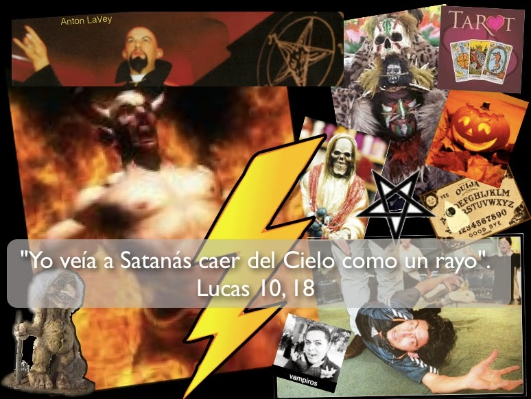

# La plaga del ocultismo y la necesidad de la conversión
  

## Sufre pesadillas con frecuencia?¿Escucha ruidos extraños en su hogar?

¿Baja la temperatura sensiblemente en su habitación? ¿Siente que algo se le sube al cuerpo cuando se recuesta? ¿Ve sombras en la noche? ¿Cambian los objetos de lugar en su casa sin que alguien los mueva? ¿Aulla su perro a las 3:00 AM? ¿Surgen plagas de insectos en su cocina aún tras limpiar y fumigar? ¿Aparecen moretones o heridas en su cuerpo de un día a otro? ¿Percibe olores putrefactos? ¿Observa “entes” que le miran con odio, blasfeman y lo atacan físicamente?.

A reserva de realizar una investigación espiritual y de emitir un diagnóstico adecuado en cada caso (que descarte la autosugestión, la imaginación u otro motivo natural), **si usted o alguien de sus familiares han experimentado o padecen hoy día alguna de esas manifestaciones muy probablemente se debe a que incursionaron en prácticas del ocultismo**, las cuales “abren puertas automáticas” a la actuación de los espíritus inmundos o ángeles caídos (demonios).

**El ocultismo es hoy una de las corrientes más comúnes y devastadoras que forman parte del movimiento herético New Age** o Nueva Era. Conjuntamente con el orientalismo, la medicina alternativa (una parte extensa de esta) y el esoterismo, este aleja progresivamente a las personas de la verdadera fe, de la Iglesia, de la vida de gracia y del camino de la Salvación. El Papa Juan Pablo II dijo al respecto: “La ignorancia en el campo religioso es aprovechada frecuentemente por grupos esotéricos o por sectas para atraer a los fieles poco arraigados en su fe”.

En mi experiencia de más de 15 años sobre el tema he podido constatar -a través de la observación ocular, de múltiples testimonios y de la consulta documental- cómo **cientos de hermanos católicos han padecido las consecuencias de esta terrible plaga:** poesesiones demoníacas, obsesiones, compulsiones y vejaciones crueles que evidencian la incursión personal o familiar en lo oculto y el efecto destructivo y pernicioso de dicha lacra. Viven auténticos dramas silenciosos porque sufren, además, la incomprensión de sus seres queridos y hasta de muchos sacerdotes. ¡Pero bendito Dios existe solución!

Etimológicamente hablando **el vocablo “oculto” significa lo que está escondido. Es decir, el ocultismo revela o da a conocer lo que estaba oculto**. “Remite a todas aquellas prácticas que nos muestran una visión del mundo desde una perspectiva mágica y sobrenatural”, indica Jean Laurent R., en su obra Grandes enigmas del ocultismo. Monseñor Donald W. Montrose, Obispo de Stockton, Califormia, dice que por ocultismo “entendemos una influencia supra-humana o sobrenatural que no es de Dios y comúnmente lo asociamos con lo que tiene influencia demoníaca”.

**El ocultismo engloba, a su vez, una amplísima gama de creencias y prácticas;** son trampas que el Maligno inventa para apartarnos de Dios pues van contra el culto, el honor y el amor que debemos rendirle únicamente a Él, como Padre y Creador Nuestro que es. Es decir, me refiero al incumplimiento del Primer Mandamiento de su Ley santa.

**Nuestro Señor, como Padre amoroso que es y sabedor del peligro que encierra el ocultismo nos advierte y ordena alejarnos de este.** Por ejemplo, en la Sagrada Escritura encontramos varias invitaciones de Dios, como en Deuteronomio 18, 9-14. En el Libro de Levítico 19, 31 leemos: *“No os dirijáis a los nigromantes, ni consultéis a los adivinos haciéndoos impuros por su causa.* *Yo, Yahveh, vuestro Dios”*. Más advertencias: Levítico 20, 6. Deuteronomio 28, 1-4 y 15-46. Y en el Catecismo de la Iglesia Católica podemos ubicar el tema en los numerales 2116 y 2117.

**El ocultismo es, por tanto, un pecado grave que da “derecho” a Satanás a provocarnos males en vida** y, si no hay conversión del bautizado, puede llevar a la condenación eterna. Igualmente grave es maldecir, practicar ritos, realizar pactos o consagraciones al Demonio y pertenecer a grupos satánicos y anticristianos.

A fin de discernir si usted o algún miembro de su familia incursionó en el ocultismo por medio de creencias y prácticas promovidas por los medios de comunicación, cursos, ritos, libros, música, caricaturas, películas, videojuegos, etc., **le muestro ahora una breve lista de las vertientes que lo conforman**, con sus manifestaciones o prácticas correspondientes:

- **Adivinación (mancias)**, astrología (horóscopos), cartomancia (tarot), carta astral, quiromancia (lectura mano), numerología, runas, cocos, café, etc.
- **Poderes paranormales (parapsicologia)** : Percepción extrasensorial y fenómenos psíquicos: telepatía, clarividencia, clauriaudiencia,  precognición, retrocognición, telequinesia, poltergeist, Método  Control (mental) Silva. Apertura del “tercer ojo”.
- **Supersticiones** : Buena” y “mala” suerte, fetiches o amuletos populares, “devociones” equivocadas a los santos (poner de cabeza a San Antonio), culto a “santos piratas” (Malverde, niño Fidencio), devoción a la “santa muerte”.
- **Magia, brujería y hechicería** : Chamanismo, curanderismo y nagualismo, limpias, viajes astrales, “espíritus de la naturaleza” (hadas, elfos, duendes, trolls), *Halloween*. Beber o verter sangre y ofrecerla, pasar por círculos de fuego, etc.
- **Espiritismo** : Clásico (ouija) y moderno (channeling), santería y vudú, ángeles zodiacales (“guías” y “seres de luz”); “niños índigo”, “niños cristal” y “niños arcoiris”, Eneagrama, Curso de milagros, *Reconnection Healing*, hipnosis, “curación” por péndulo, Constelaciones Familiares.
- **Demonismo** : Luciferismo (“misas rojas”) y satanismo (“misas negras”). Sobre esta última corriente, una de las más fuertes entre la juventud, subrayo expresiones y actitudes que se han traducido en el surgimiento de “tribus urbanas” como darks, góticos, vampiros y hasta los zombies. Cuidado, por cierto, con **el piercing, las escarificaciones y los tatuajes** pues son “sellos” que Satanás emplea para influir y dañar a quien los graba en su cuerpo.

**Si practicó usted –a sabiendas o por ignorancia- alguna o varias de estas expresiones le invito a:** 
- Confesarse de esos pecados
- Renunciar al Maligno y a sus obras (renovar sus promesas bautismales)
- Convertirse a Dios 
- Leer la Biblia y estudiar su fe
- Vivir la gracia divina (Misa, Eucaristía, horas santas)
- Rezar el santo Rosario y la coronilla de la Misericordia
- Consagrarse a los Sagrados Corazones de Jesús y de María.

**Dios le ama profundamente y no quiere que usted ni los suyos se pierdan ni sufran más las consecuencias que conlleva el alejarse de Él** con la práctica y el pecado del ocultismo. Su mayor muestra es que Cristo, su Hijo, se encarnó y con su pasión, muerte y resurrección venció al Enemigo y nos alcanzó la libertad. Recuerde: *“Yo he venido para que tengan vida y la tengan en abundancia”*. (Juan 10,10).

*Jaime Duarte Mtz., Director CISNE*  
*@JaimeDuarte*  
*@CISNE_2012*