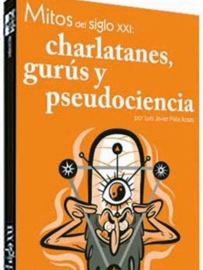

# Mitos del siglo XXI: charlatanes, gurús y pseudociencia
Con *"evidencia, humor y amenidad"*, Luis Javier Platas Rosas [@PlataLuisJavier](https://twitter.com/PlataLuisJavier) autor de Mitos del siglo XXI: charlatanes, gurís y pseudociencia (Ed. Lectorum - Algarabía, México, 2013) echa por tierra -como ya otros investigadores lo hemos hecho en diversas ocasiones- los siguientes nueve mitos promovidos por el movimiento New Age:

* Mito 1: Niños Índigo
* Mito 2: Dieta macrobiótica
* Mito 3: Teoría Gaia
* Mito 4. El eneagrama de la personalidad
* Mito 5: Los mensajes del agua de Masaru Emoto
* Mito 6: Constelaciones Familiares
* Mito 7: Psicoterapias de la Nueva Era
* Mito 8: Medicina holística
* Mito 9: Misticismo cuántico

  

El propósito de este libro -se lee en la solapa- es mostrar a quienes tienen curiosidad de saber si detrás de algunas creencias de la Nueva Era en verdad existe una explicación validada por la ciencia o si, por el contrario, aceptarlas se trata tan sólo de una cuestión de fe o de principios, de una filosofía de vida. **Con esta obra se desmoronan varias capitales de la mentira**.

**Platas** no es el primero, ni será el último, en desmentir las tesis de las creencias acuarianas y de sus adeptos ("neorianos", les llama). Aquí ya hemos citado al **Dr. Sergio de Régules** por su obra Cuentos Cuánticos y a **Jean Marie Abgrall** por Los charlatanes de la salud.
