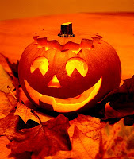

# ¿Queremos Halloween?

Desde el año 840, se celebra el 1° de noviembre, en la Iglesia Católica, el día de “Todos los Santos”, y la vigilia vespertina para preparar esta celebración (31 de octubre); en la cultura inglesa se tradujo con el nombre de **“Hall Hallow's Even”** (vigilia de todos los santos).

Sin embargo, un grupo de antiguos sacerdotes del pueblo celta, llamados Druidas, que habitaron en las regiones de Inglaterra, Francia, Irlanda y parte de la Península Ibérica, manipularon el nombre para transformarlo en **Hall Halloween Eve**, que significa la Noche Apartada. Esa noche, 31 de octubre en su calendario, celebraban la fiesta de Samhain “dios de los muertos” en donde invocaban a los malos espíritus o demonios. Para ellos era la época más propicia para la comunicación con los espíritus y para la práctica de la adivinación y la hechicería, pues decían que las almas de los muertos visitaban sus casas ese día.

Ofrecían a los muertos mesa de alimentos. Recorrían casa por casa pidiendo donativos (comida, dinero, animales y un niño pequeño o una virgen) para quemarlos en una gran fogata y ofrecerlos a Samahin.

Al pedir, amenazaban con dañarlos. Si accedían (“trato”), daban una fruta con una vela dentro (para que los demonios no entraran y mataran a los habitantes de la casa). Si no aceptaban, los druidas marcaban la puerta de la casa y amenazaban que Samahin los destrozaría (“treta”).

Al finalizar esta “fiesta”, los espíritus eran “sacados” del pueblo por gente disfrazada como los espíritus o demonios, con formas de horror, con las pieles y cabezas de los animales sacrificados (como hoy, por cierto, usan los satánicos en sus eventos) para “engañar” a los espíritus y evitar que se quedaran en ese lugar. Con las cenizas y restos de los sacrificios, los druidas hacían otro rito para conocer el futuro y la suerte de los siguientes doce meses. La fecha escogida: ¡31 de octubre!

Lamentablemente la fiesta del Halloween sigue hoy más vigente que nunca; colegios, que se dicen católicos, hasta la defienden y celebran aun a sabiendas de su origen.

Declaraciones de reconocidos ocultistas confirman que su festividad va más allá de sólo disfrazar a los niños para pedir dulces (trick or treat). Por ejemplo, **Sandor Anton Levey**, “gran sumo sacerdote” de la iglesia de Satanás y escritor de la “Biblia satánica”, dice que para los satanistas es su cumpleaños y el 31 de octubre son días de gran conmemoración.

La Sra. **Cristina Kneer de Vidal**, ex satanista y ex espiritista, asegura igualmente que una de las ocho fiestas del satanismo en el año es el equinoccio de primavera, al igual que el Halloween, en las cuales se llevan a cabo sacrificios de animales y humanos en “misas negras”. Se roban a los niños y bebés, se les viola para “quitarles la pureza”, se les extrae el corazón y se lo comen los satánicos, afirma.[i]

Asimismo, en la ‘Noche de Brujas’ “se mezclan aspectos satánicos, sensuales, de sexo y drogas”, dijo el padre Jorge Echegoyen Flores, director administrativo del Seminario Diocesano de Tijuana; se convirtió en muchas partes como pretexto para los desmanes, agregó.[ii]

Hasta la **UNICEF** (Organización de las Naciones Unidas para la Infancia), repartió cajas a los niños en 2001 para recolectar ese día dulces y dinero, a fin de financiar programas abortivos en países pobres.

El **Pbro. Jordi Rivero** propone como alternativa a la “noche de brujas”: “Los cristianos debemos no solo desenmascarar el mal sino ser además luz en las tinieblas. Debemos abogar por el retorno a la verdadera celebración de la Fiesta de Todos los Santos. Se pueden hacer muchas celebraciones en torno al los santos. Los niños se pueden disfrazar de un santo favorito y aprenderse su vida, especialmente sus virtudes, con el fin de imitarlas. Los mayores pueden leer sobre los santos, tener una fiesta en honor a un santo favorito de la comunidad o de la familia”.[iii]

[i] “Advierte ex satanista peligros de celebrar la noche de brujas”, El Norte, 31 de octubre de 1992. Véase también: http://www.corazones.org/apologetica/practicas/halloween.htm También apareció esta noticia en Info – Spes, Boletín Informativo de la Fundación S.P.E.S., No. 26, octubre de 2002.
[ii] El Sol de México, 27 octubre 1998.
[iii] Pbro. Jordi Rivero, “Halloween o víspera de Todos los santos: ¿cuál de las dos celebran sus hijos?”, en http://www.autorescatolicos.org/misc07/jordiriverohallo.htm
Por Jaime Duarte Mtz., Director del CISNE.  

Ver presentación en:
https://es.scribd.com/doc/178190231/El-Peligro-del-Halloween

<https://www.cisne.org.mx>  
**@CISNE_2012**