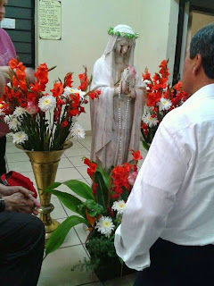
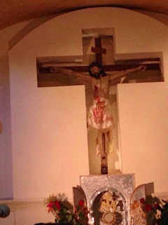
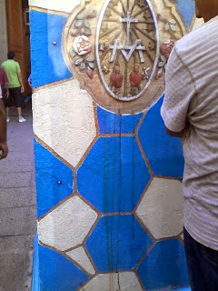

# ¿Por qué lloran imágenes y efigies sangre en Guadalajara?
El pasado mes de octubre de 2014 **en el templo de la Inmaculada**, zona centro en Guadalajara, se dio a conocer que una efigie de la Virgen María comenzó a llorar lágrimas de sangre.

De acuerdo con fuentes consultadas por un servidor, **la estatua llevaba al menos un par de semanas "llorando", ¡pero no era la única!** Dicho fenómeno también se presentó en otras imágenes (como se muestran aquí), tales como un medallón de los Sagrados Corazones, y un Cristo crucificado, del cual emanó sangre de su costado.

La noticia corrió como pólvora y los medios de comunicación corrieron a buscar al Cardenal Mons. Francisco Robles Ortega, Arzobispo de Guadalajara y presidente de la Conferencia del Episcopado Mexicano (CEM), para interrogarle al respecto del suceso. En el siguen video declaró "prudencia":

<iframe width="480" height="360" src="https://www.youtube.com/embed/EM5PsfpcLg8" title="YouTube video player" frameborder="0" allow="accelerometer; autoplay; clipboard-write; encrypted-media; gyroscope; picture-in-picture" allowfullscreen></iframe>

La efigie citada fue retirada del templo -bajo el cuidado del padre exorcista Jesús Ceja- y llevada al Arzobispado donde está hoy siendo investigada. Y según fuentes -no oficiales- **¡hay allí otras 30 imágenes exudando sangre!** Algo verdaderamente insólito de ser cierto.

Mientras las autoridades eclesiásticas esperan confirmar la autenticidad de estos fenómenos a través del análisis científico, a fin de expresar una posición formal, prudente y responsable, **me permito a continuación expresar libremente una opinión a manera de hipótesis acerca del origen que podrían motivar tan impactante acontecimiento**, en el contexto de nuestra realidad nacional actual:

> Cuando se han registrado casos similares a este en otras partes del mundo, los fenómenos místicos se acompañan simultáneamente de aroma a rosas, escarcha y milagros, como también de revelaciones privadas que Nuestro Señor o la Virgen María misma dan a conocer a almas privilegiadas o instrumentos místicos, y que explican con más exactitud la(s) causa(s) de la extraordinaria manifestación. Así, **entre otras "razones" divinas, tenemos**:

1. **Profundo dolor de María Santísima por los pecados** del mundo (y de una comunidad en particular) cometidos contra su Hijo y el Padre Dios. Violación masiva a la Ley de Dios.

2. **Pecados graves que "claman justicia al Cielo"**, especialmente los propiciados por el crimen abominable del aborto.

3. **Sufrimiento de la Madre de Dios** por sus hijos amados quienes, habiendo pecado, se condenan irremediablemente en el Infierno. 

4. **La aflicción de la Virgen** (expresada en lágrimas humanas y de sangre) precede la escenificación de eventos calamitosos; señal de advertencia para lograr un cambio real de vida en las personas. Así lo demuestran los mensajes recibidos por los videntes en las apariciones marianas de La Salette, Akita y Fátima, reconocidas por Roma.

Ahora bien, si a lo anterior añadimos el caso de los **exorcismos de Ángel**, tema aquí ya comentado (leer) y los recientes **milagros eucarísticos** (como el de [Tixtla, Guerrero](https://www.youtube.com/watch?v=1GrpXTPPaoc), y otros más bajo investigación), considero que Nuestro Señor Dios está buscando más formas -ciertamente extraordinarias e impactantes- de llamar la atención de los Obispos, de los laicos y de todos los mexicanos.

Un análisis de nuestra **difícil realidad política, económica, social y cultural** nos llevaría a concluir que, en efecto, le estamos dando la espalda a Dios. Algunos ejemplo:

* Aborto: 120 mil bebés asesinados legalmente en el vientre de su madre
Disfunción familiar: "unión libre", divorcio en aumento, separación, abandono del hogar, violencia intrafamiliar, "sociedades de convivencia" (uniones homosexuales)
* Desigualdad, pobreza y miseria extremas: 50 millones de compatriotas viviendo en condiciones deplorables (pésima asistencia de salud y de educación). Crisis de migración
* Estancamiento económico, informalidad y desempleo. Próxima crisis del dólar
* Medios de comunicación que manipulan la verdad y mal informan; presas de intereses y negados a evangelizar
* Delincuencia organizada, injusticia e impunidad: robo, secuestro, crímenes, narcotráfico, trata de blancas, tráfico de niños, etc. (Caso: 43 desaparecidos de Ayotzinapa)*
* Destrucción del medio ambiente
* Autoridades y clase política: corruptas, incompetentes, abusivas, insensibles y en contubernio con mafias delincuenciales. Dispendio de recursos y falta de representatividad democrática
* Alejamiento de la fe y de la Iglesia: ateísmo, secularismo, esoterismo, gnosticismo  sincretismo, ocultismo (New Age), relativismo...
Apatía, indiferencia cívica, bullying, desinterés político de la sociedad, deshumanización
* Desestabilización nacional: intento de grupos guerrilleros, auto defensas, carteles de la droga y criminales por detonar, con sus actos violentos, una rebelión o insurrección armada en Guerrero, Michoacán, Oaxaca, y en todo el País

## En conclusión:

**Las lágrimas de sangre de la Virgen, como otros sucesos místicos relevantes, SIGNIFICAN no únicamente una invitación suplicante** a que usted y yo reflexionemos profundamente acerca de nuestra mala actuación, a que examinemos con franqueza de cara a Dios nuestra conciencia y a que nos convirtamos con sinceridad de nuestros pecados, sino también un grito desesperado que brota del Corazón de María para amarnos como hermanos, como Iglesia y como Nación para volver finalmente la mirada a su Hijo Jesús. ¡No existe hoy ni habrá ya otro camino fuera de Cristo!

**La Aparición de la Virgen de Guadalupe** en el Tepeyac en 1531 es un sello de predilección por esta Nación. México esta llamado así a cumplir una misión especialísima dentro del Plan de Salvación de Nuestro Señor para la Humanidad en estos últimos tiempos. El Enemigo mortal lo sabe y busca afanosamente impedirlo a como dé lugar.

**Roguemos a Nuestro Señor aumente nuestra fe, esperanza y caridad**, y con ayuda de su Espíritu Divino nos dé la gracia de la Sabiduría y la Fortaleza necesarias para enfrentar con valor los difíciles acontecimientos que están por venir.

**Le invitamos a participar en una jornada de oración por la paz en México, y a sumarse a la Consagración del Cardenal, Mons. Norberto Rivera, a los Sagrados Corazones de Jesús y de María el próximo 12 de diciembre. Ver video de invitación de Mons. Juan Sandoval Íñiguez:**

<iframe width="640" height="360" src="https://www.youtube.com/embed/5zcAOLIyGaU" title="YouTube video player" frameborder="0" allow="accelerometer; autoplay; clipboard-write; encrypted-media; gyroscope; picture-in-picture" allowfullscreen></iframe>

Por Jaime Duarte Mtz., Director del CISNE.  
<https://www.cisne.org.mx>  
**@CISNE_2012**