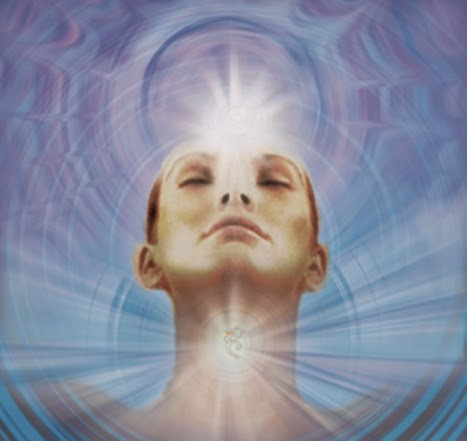

# Theta Healing o la 'energía' curativa ¿de Dios?
Se trata, explican sus promotores de manera rebuscada, de una técnica de sanación para **“transformar tu salud física, emocional y espiritual, así como tus relaciones, tus finanzas y tu capacidad intelectual”** mediante el “cambio del ciclo de las ondas del cerebro para alcanzar el estado **‘Theta’”**, similar al estado de trance que trabajan los hipnotistas. Es decir, que las ondas cerebrales provocadas por la mente cerebral son **“energía creativa”** que puede curar.

Theta Healing fue fundada en 1995 por la estadounidense “naturópata”, terapeuta de masaje y “lectora Intuitiva”, Vianna Stibal, quien asegura haber sanado de cáncer instantáneamente en su fémur derecho tras aplicar esta técnica.  
En el sitio www.thetahealingmexico.com la describen así:  
     “*TethaHealing®* es una técnica que enseña cómo hacer uso de nuestra intuición natural, basada en el Amor Incondicional del "Creador de Todo lo Que Es". Capaz de solucionar problemas a nivel físico, emocional y espiritual, logrando cambios profundos en cuerpo y mente.

“Hoy utilizamos el nombre *Theta Healing®** para hacer referencia a la onda Theta, cuyo origen se remonta a la letra **egipcia** y griega Theta que entre otras cosas significa **Alma**.
 “Esta técnica es una **herramienta que nos da el poder** y la habilidad para quitar, sacar, y reemplazar sentimientos, programas, creencias y pensamientos que nos influencian negativamente, sutituyendolos o cambiándolos por pensamientos, sentimientos, programas y creencias positivas. Esto es de lo más poderoso, rápido y eficiente que tiene la técnica.      […] Al usar esta técnica **alcanzamos la más alta claridad de sabiduría del amor, conectandonos con la energía de "Todo lo Que Es"**. ThetaHealing® puede ser descrito fácilmente como un verdadero milagro en nuestra vida. […] El Creador es la Energía que creó todo, es la intención que generó **el principio de todo, es la Energía Universal**, la Energía de Amor incondicional”.

¿Nota su **postura relativista** al no hablar de Dios Uno y Trino o tampoco referirse a Nuestro Señor como Padre? Se trata de planteamientos que rayan en el **panteísmo y en el orientalismo**. 

Asimismo, ¡Dios no es energía! Esta es una de las equívocas y reiteradas afirmaciones del movimiento Nueva Era. Tampoco existe esa "energía" mística que obcecadamente pregona esta herejía y la onda (cerebral) Theta (=alma) no se sana sin la gracia sacramental.

**Dios sí puede curarnos pero no lo hará mediante técnicas** que recurran al mismo tiempo a prácticas oculistas, opuestas a su Voluntad, ya descritas con anticipación en este blog.

¿Ne es así? Mire: actualmente **ThetaHealing** enseña en sus cursos cómo encontrar su “alma gemela”, descubrir la “magia” del cuerpo, la “liberación de energía acumulada por las emociones”, los “niños arcoiris”, “meditaciones guiadas, círculos con tambores rítmicos para conectar con su animal de poder, viajes con cristales, contactar con hadas, lecturas del futuro y de los ángeles, experimentar la **telequinesis**, sanar animales, así como ver y cambiar auras”. ¿Qué tal? 
Su enseñanza y práctica, como puede usted mismo apreciar, es igualmente paranormal, esotérica y espiritista. ¡Vaya cocktail!

Por Jaime Duarte Mtz., Director del CISNE.  
<https://www.cisne.org.mx>  
**@CISNE_2012**