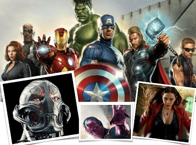

# Los Vengadores, ahora ¿esotéricos y ocultistas?
**Fui al cine el pasado 30 de abril a ver "The Avengers", invitado por mis mejores amigos de Familia Misionera**. Disfruté mucho de la cinta pues se trata de mi género favorito, al igual que la ciencia ficción. Además, siento atracción por este tipo de filmes porque me recuerdan mi niñez; crecí con los superhéroes y siempre soñé con volar como Supermán.

Pero como converso a Dios e investigador socio-político no dejé ese día del Niño guardada mi fe en casa, y mientras disfruté de la inquebrantable rectitud y del valor del Capitán América, analicé con atención las imágenes, la trama y el guión de la secuela de la saga maestra de Marvel: Los **Vengadores**.

A continuación **comparto con ustedes algunos "detalles" curiosos de la cinta**, mismos que deben llamarnos la atención por su velado contenido esotérico y ocultista:

1. El nuevo enemigo de los Vengadores: Ultrón
Esta especie de cyborg tiene ojos rojos encendidos, cuernos invertidos, voz gutural, es extremadamente violento y odia al ser humano. Sí, sus rasgos apelan al Demonio. Y si es exagerado, ¿recuerdas cuando en un templo católico destruido aparece sentado en la silla sacerdotal y dice: "sobre esta piedra edificaré mi reino"? En otro momento afirma: "he venido a salvar al mundo" (cuando está en la mina para robar el vibranio).

2. El nuevo amigo o superhéroe: Visión
Sí, un tipo extraño que habla con voz suavecita, viste capa amarilla y fue "creado" en un "arca" tras los experimentos de Stark, Bruce y un rayo de Thor (más el cetro de Loki que robó Ultrón). Pero lo relevante es su gema amarilla (del" infinito") ubicada en su frente, del cual sale un poderoso rayo. Además, cuando revela su identidad en el Centro de Mando o cuartel general de los Vengadores, declara: "Yo Soy". ¿Ya lo advierte? ¿No?     
     En la vida real, las gemas son utilizadas por el movimiento Nueva Era con el fin de lograr: curación, comunicación con muertos y contacto con extraterrestres. Si asocian la piedra con el "infinito" y la forma como Dios se presenta al hombre en el Antiguo Testamento cuando Él dice: "Yo Soy", pues ya lo tiene: Visión sería "Dios". Ah, y agréguese que **la gema sobre su frente** significa acceso a poderes superiores o paranormales. 
     En el mundo hindú, oculista y esotérico se cree que para llegar a Dios se debe abrir el **Tercer Ojo o chakra frontal**, y así es como se adquieren siddhis (en sánscrito es "perfección" o "poderes") como telequinesia, telequinesia, precognición, retrocognición, ciencia infusa, levitación, etc. ¿Lo ve? Visión sería "súper poderoso".

3. La nueva enemiga y ¿amiga?: Wanda, la bruja escarlata
Más allá del tema de que ella y su hermano *Quicksilver* son hijos de "Magneto" (en los cómics de X-Men), su sola aparición ya de suyo lo dice todo: ocultismo. Esta chica adolescente usa poderes de telequinesia, control mental, adivinación, lectura de la mente y hechizos primero para atacar a los Vengadores y, luego, para defender a los habitantes de los robots de Ultrón. A los Vengadores los divide y a la gente la embruja para abandonar la ciudad). Hay dos escenas peculiares más: aquella en la que hace con sus manos la señal semi satánica y, la otra, cuando presa del odio por la muerte de su hermano se lanza sobre Ultrón (vuelve a realizar la señal satánica) y le saca el "corazón" con su brujería. (Claro, como este es un cyborg y es un dispositivo de metal el que Wanda arranca mentalmente de su pecho, no luce tan grotesco, no hay sangre, pero el acto es usado en el satanismo: a las víctimas se les viola y se les saca el corazón en sus sacrificios humanos). Eso es muy fuerte, ¿no le parece?  
     Al final, Wanda es incorporada a las filas de los superhéroes. De nuevo encontramos el mismo argumento reciente de Harry Potter y Maléfica: El mal y la magia son "buenos" y hasta "bellos", lo cual es confuso y ¡perverso! 

4. Rituales secretos y ocultos: Natasha y Thor
Surge más información acerca del origen de Natasha Romanoff (la "Viuda Negra") que, aunque escasa, deja entrever su participación y manipulación de joven en un ritual de muerte en un grupo secreto. Al parecer, dada su nacionalidad, fue entrenada por grupos comunistas para matar eficazmente sin piedad ni remordimientos. En la vida real, en EEUU se diseñó el **Plan MK-Ultra** ("lavado de cerebro") en los 50's para anular la identidad y conciencia de espías y militares. La bruja Wanda le recuerda su obscuro pasado y le reaviva sus heridas o traumas mentales.  
     Respecto a Thor, dos situaciones: 
     a) Se introduce en una caverna obscura y se mete al "agua de la visión" para escuchar allí a los "espíritus del sueño" que le digan qué trama Ultrón con el cetro de Loki (y le muestran qué sucederá), y   
     b) Su centinela en su planeta Asgard, Heimdall, pone los ojos en blanco y exclama: "con ellos todo lo veo". Es decir, los demonios le revelan a **Thor** el porvenir y el centinela muestra una posesión demoníaca (como sucede comúnmente en un transe posesivo).
     Lo anterior, sin mencionar que el príncipe de Odin (Thor) es el "dios del trueno" (neopaganismo).

**Asimismo, miembros del CISNE me han dicho que la estrella en el escudo del Capitán América** es el pentagrama satánico; que en el martillo de Thor aparece grabada la  Triqueta (Trinidad Satánica), y en su uniforme se aprecia la figura del macho cabrío (Satanás). Personalmente pienso que no es así esto, pero... ya hay varios símbolos, signos, palabras, acciones, etc. relativos al mundo del esoterismo y del ocultismo en esta segunda parte de la serie, que bien podrían corroborarlo. ¿Alguien podría preguntárselo al genio de **Stan Lee?**

**Por lo pronto, ya se anticipa que The Avengers superarán los mil millones de dólares en taquilla; ¡bárbaro!** Y vendrán en 2016 más secuelas de Iron Man, Thor, etc., como el filme en este 2015 de Batman vs Supermán donde el Hombre de Acero será proclamado como dios por la Humanidad (cinta producida por Warner y DC Comics).

Invito, especialmente a los jóvenes, a que estén muy atentos a los mensajes -visibles y subliminales- de esta película de acción y de otras tantas, con objeto de no dejarse seducir por su contenido esotérico y oculista, y no terminen cayendo en la trampa del Maligno.

Por Jaime Duarte Mtz., Director del CISNE.  
<https://www.cisne.org.mx>  
**@CISNE_2012**