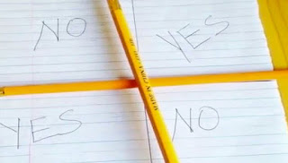

# ¿Qué onda con el "juego" de Charlie, Charlie? Espiritismo y adivinación disfrazados

El "juego" de moda "Charlie, Charlie, are you here?" 'viralizado' en las redes sociales esta semana en España, Argentina, Estados Unidos y México forma parte de una novedosa, astuta y accesible forma de ocultismo. En efecto, no es un juego; se trata de la inculturación del espiritismo y de la adivinación entre la juventud con la consecuente invocación y contaminación demoníaca, tal y como se logra con la maldita tabla de la ouija, pero de manera rápida, masiva y sencilla. (Ver nota del diario El Universal [aquí](https://www.eluniversal.com.co/mundo/charlie-charlie-el-juego-paranormal-que-atemoriza-los-jovenes-194963-NCEU295109). )

Una nota de la BBC Mundo indica que el usuario de Twitter llamado @_kluh "fue el primero en utilizar la etiqueta #CharlieCharlieChallenge". La nota [aquí](https://www.bbc.com/mundo/noticias/2015/05/150526_charlie_charlie_challenge_gtg).
No voy a explicar aquí en qué consiste esta inédita clase de "diversión", "reto" o perversa forma de invocación de espíritus malignos -ya hay cientos de videos que así lo hacen- sino a señalar **brevemente tanto sus orígenes remotos como próximos** y a advertir acerca de sus  terribles consecuencias para sus "jugadores".

Todo surge en el siglo XIX, con el surgimiento del espiritismo clásico (que asegura invocar primordialmente a los "muertos" y a los ángeles caídos):

## El caso de las hermanas Fox
En 1849, en el pueblo de Hydesville, Nueva York, tres adolescentes escucharon que una mesa "crujía" fuertemente, ruido que interpretaron como un mensaje, quizá de un hombre que había sido asesinado en su casa. El tema atrajo la atención, se divulgó y nació la práctica de invocar espíritus, como la curiosidad paranormal.

## Origen de la Ouija
En 1853, en Francia, el "espiritualista" **M. Planchette** diseñó una ouija similar a la popular actual. Por cierto, ya Pitágoras (540 a.C.) usaba un artefacto parecido y en China, antes del nacimiento de Confucio, se usaba algo similar.

## Origen del termino Espiritismo
En 1857, en París, Allan Kardec introdujo el término "espiritismo" en su obra **Le Libre des esprits** y se refirió a la existencia de "espíritus superiores" de diversas categorías, entre los cuales se encontraban los "espíritus malignos". Así, surgieron también espiritistas famosos como Cornelius, Swedenborg, Agripa y Mesmer (inventor del biomagnetismo), entre otros.

## Secta Espiritualismo Trinitario Mariano en la Ciudad de México
Nace la secta Espiritualismo Trinitario Mariano en la Ciudad de México en 1866 tras la muerte de Jacinto Roque Rojas, fundador de la "Iglesia mexicana patriarcal de Elías". Es un sincretismo de catolicismo y espiritismo, tremendo. Usan imágenes de la Virgen, San Miguel Arcángel, San José, etc. Invocan los "hermanitos" (espíritus de los muertos). Creen en el "Gran Jehová y en una "trilogía divina", integrada por Moisés, Jesús y Elías, como en la reencarnación de las almas. ¡Rezan el Rosario! En 1994 existían más de mil templos de la secta en el D.F. Ver libro de Silvia Ortiz Echániz al respecto [aquí](https://www.dimensionantropologica.inah.gob.mx/?p=771).

## La Sociedad Teosófica
La Sociedad Teosófica, fundada en **1875** por masones como Helena Petrovna Blavatsky y el coronel Henry Steel Olcott, abrazó y promovió con fuerza el espiritismo. Blavatsky, como sus sucesoras Anie Besant y Alice Bailey eran médiums connotadas; recibieron de los "espíritus" (demonios) varios mensajes que compilaron en más de 30 libros. (En la Masonería, por cierto, se practica toda forma de espiritismo).

## Se celebra el Primer Congreso Espiritista en 1852
En Cleveland, y dos años después se registra la existencia de más de diez mil médiums solo en Estados Unidos.  
En el siglo XX rebrota el **espiritismo, ahora llamado "moderno" ("channeling" o canalización)** que, además de invocar a potencias malignas y a espíritus de los muertos, invita en sus sesiones a "entidades superiores" o "espíritus guías" (llámense, dicen, Jerarquía Universal, extraterrestres, "dioses" o "muertos poderosos"). Ubiquemos los siguientes casos y eventos:

1. **En 1920 surge la Liga Espiritista Cristiana Mundial**, misma que en el año 2007 llevó al cabo su 5º Congreso Espiritista Mundial en Cartagena, Colombia.  
2. **La empresa Parker Brothers compró en 1966** los derechos sobre el "juego" de la tabla de la ouija a William Fuld, quien la había patentado previamente. 
3. **Multiplicación de canalizadores famosos en Occidente** omo Helen Schulman (con su obra "Un Curso de Milagros"), Edgar Cayce, Benjamin Creme (contacto con el "Maitreya"), Jon Klimo (récord mundial en penetración en su cuerpo de "muertos"), J.Z. Knight (productora de la cinta "¿Y tú qué sabes?"), Jane Roberts, Ruth Montgomery, Mark Prophet, Lee Carroll (cuyo "ser espiritual" revela la existencia de los "Niños Índigo"), y Pat Rodegast. Todos estos congregan a miles de personas en sus sesiones espiritistas.
4. **Ahora las "entidades" revelan sus nombres** y dictan libros mediante "channeling" que son consumidos masivamente por millones de personas en el mundo. Destacan los demonios: "Djwahl Jul", "Krayon", "la Voz", "Saint Germain", "Emmanuel", "Ramtha" y "Lilly".
5. **El cine y la TV difunden cintas y series relativas al fenómeno espiritista**,lo que ha acelerado -lejos de amainar- la curiosidad por lo parapsicológico. Encontré más de diez títulos relativos al "juego" de la ouija; su dosis de terror ha llevado simultánea y paradójicamente también a la negación de la realidad sobrenatural maligna. 
6. **Se celebra el XXI Congreso Espírita Nacional** en diciembre de 2014, en España, con el titulo "el mundo invisible". Hay testimonios del evento y hasta grabadas las conferencias de los ponentes en Youtube, algunos expositores, incluso, trataron de desmitificar el espiritismo. ¡Hasta clases sobre el tema hubo para niños durante el evento!

**En síntesis, el mundo occidental ha abierto progresiva y sutilmente su mente y corazón al espiritismo**, se ha popularizado haciéndolo ver como "normal" o "común", sin riesgo, pero no ha advertido que se trata de una estrategia perversa que pretende abrirle la puerta de la casa, la escuela y el mundo a verdaderas legiones de demonios, sin mencionar todas las prácticas oculistas de adivinación, supersticiones, esoterismo, brujería (magia y hechicería) y satanismo difundidos a través de **música, videojuegos, caricaturas, películas, piercing, sectas vampíricas**, etc. ¡Toda una plaga mundial!

### CONSECUENCIAS
**El "juego" de "Charlie" -quien lo haya inventado- guarda íntima relación con la ouija** por la consulta a un "objeto", las palabras "sí" y "no", el fraseo de las preguntas a "alguien ausente" y el deseo de las personas por develar o conocer el porvenir (adivinación). Satanás ha elegido desde antaño a esta tabla de madera -ahora lo hace con cualquier papel y lápices, pero lo ha hecho ya antes con tijeras y hasta con la computadora en ciertos "jueguitos"- para conseguir dañar psíquica, física y espiritualmente a la gente.

**Todos los sacerdotes exorcistas que he leído y conozco personalmente** -hasta líderes protestantes destacados como Walter Martin- han coincidido en advertirnos acerca de los efectos producidos por el "juego" de la ouija y la práctica espiritista como tal: obsesiones, compulsiones, infestaciones y posesiones diabólicas. Ello se traduce en fenómenos espantosos, como enfermedades, fracasos y hasta muerte.  

**Supe del caso de una jovencita en Metepec**, Estado de México, quien sufrió una posesión demoniaca por simplemente cuidar la puerta para que mamá no llegara a ver a sus amigas jugar con la ouija en su casa. Así, ingenuamente, salió un demonio de la tabla y entró a su cuerpo. Nublada en su mente, se arrojó por la ventana y murió. ¿O qué tal el caso de los chicos de 11, 18 y 19 años que, el 16 de marzo pasado en **Bogotá**, fueron hospitalizados por sus "comportamientos agresivos" tras jugar con dicha tabla? Ver nota [aquí](https://www.elespectador.com/bogota/hospitalizan-a-tres-jovenes-tras-jugar-con-la-tabla-ouija-en-bogota-article-549801/).

**Circula afortunadamente ya por WhatsApp la advertencia del Pbro. Ernesto María Caro Osorio, exorcista en la Diócesis de Monterrey**, sobre dicha práctica. Recojo su advertencia final: "...quiero prevenir a los jóvenes y a los papás, en fin, a todo el mundo del terrible peligro que se corre cuando "inocentemente" participamos de estas prácticas.
"Charlie, Charlie no es un Juego, es una puerta que abre la posibilidad al demonio de dañar nuestras vidas y las de todos los que están a nuestro alrededor.

Le invito a leer completo el comentario del padre en un blog amigo: http://contranewage.blogspot.mx/2015/05/el-padre-ernesto-maria-caro-exorcista.htmlnal: 

Ver entrevista al exorcista español, Pbro. José Antonio Fortea en Aciprensa: "¿Charlie Charlie es un juego inofensivo?" [aquí](https://www.aciprensa.com/noticias/charlie-charlie-es-un-juego-inofensivo-famoso-exorcista-advierte-peligros-70834)

Por Jaime Duarte Mtz., Director del CISNE.  
<https://www.cisne.org.mx>  
**@CISNE_2012**