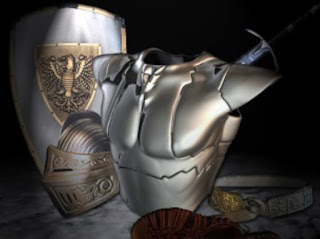

# Armas espirituales frente a la Nueva Era y Satanás
Al final de nuestros seminarios y conferencias la gente siempre nos pregunta angustiada qué hacer ante las infestaciones, obsesiones, vejaciones y posesiones malignas; el asedio del Maligno, en pocas palabras. He aquí está la respuesta.

1. Renunciar sinceramente y para siempre a Satanás y a sus obras
2. Reconocer a Jesucristo como único Dios, Señor y Salvador
3. Confesar los pecado al sacerdote
4. Consagrar nuestra persona, vida, familia y hogar al Sagrado Corazón de Jesús y al Inmaculado Corazón de María santísima

## Seguir una vida de gracia
Consulte y descargue el siguiente documento donde le explicamos cada punto, a manera de guía, orientación y de oración: https://es.scribd.com/doc/272198554/Recomendaciones-Espirituales

<iframe class="scribd_iframe_embed" data-aspect-ratio="0.7729220222793488" data-auto-height="false" frameborder="0" height="800" id="doc_40955" scrolling="no" src="https://www.scribd.com/embeds/272198554/content?start_page=1&amp;view_mode=scroll&amp;access_key=key-rgJ6HjtvbwsIyJcldKYB&amp;show_recommendations=true" width="600"></iframe>
