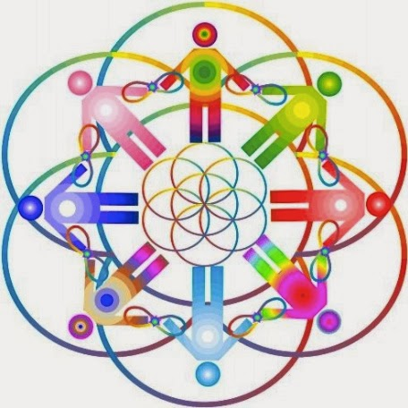

# Constelaciones Familiares. Osho, hinduismo y espíritus presentes
Ante el boom de dudas y preguntas sobre la **Terapia Sistémica Familiar** en México (también conocida como Constelaciones Familiares) presento a continuación un extracto del tema publicado en mi libro "El engaño de la Nueva Era". (2012).

## Le adelanto mi conclusión
Si bien acierta esta "psicoterapia" en advertir cómo nuestro pasado nos influye, o bien, ha dejado huellas (por heridas o recuerdos dolorosos causados por familiares o seres queridos) que se proyectan en el presente en nuestra persona -lo cual no es nuevo y otras escuelas de Psicología igualmente enseñan-, falla en asegurar que es posible detectarlas muy atrás en el árbol genealógico y, más aún, pretender curarlas con su extraña metodología.

  

Su metodología: 1. Emplea **tesis hinduistas**, como ya habíamos aquí reproducido en un artículo del padre Julio Vega-Hazas ver [aquí](https://info-ries.blogspot.com/). 2. De acuerdo con el terapista de esta misma "escuela" Daan van Kampenhout en su libro "La sanción viene desde afuera", hay presencia de entidades (espíritus malignos) y "espíritus de los muertos" en las "constelaciones". 3. Su fundador Bert Hellinger, ha  comenzado a mezclarla con la cosmovisión del polémico "gurú del sexo" Osho.

Se comprende entonces el por qué se puede "saber" el origen del daño psicológico - emocional en un paciente: Los demonios los informan al **"constelador"** y lo revelan en los **"constelados"** al tomar posesión de su mente y voluntad en los socio dramas.

Testimonios de ex colaboradores de Hellinger han señalado que emplea técnicas Nueva Era en sus enseñanzas.

**¡Sólo Cristo, Jesús, puede echar atrás el reloj de mi vida y sanar íntegramente nuestras heridas más profundas!**

Extracto del libro de **Daan van Kampenhout**:
<iframe class="scribd_iframe_embed" data-aspect-ratio="1.33234859675037" data-auto-height="false" frameborder="0" height="800" id="doc_28394" scrolling="no" src="//www.scribd.com/embeds/211921460/content?start_page=1&amp;view_mode=scroll&amp;access_key=key-20sdjbsi4l89gm3ua1s&amp;show_recommendations=true" width="600"></iframe>

Extracto de mi libro sobre el tema:
<iframe class="scribd_iframe_embed" data-aspect-ratio="0.708006279434851" data-auto-height="false" frameborder="0" height="800" id="doc_7695" scrolling="no" src="//www.scribd.com/embeds/211916257/content?start_page=1&amp;view_mode=scroll&amp;access_key=key-22shiplca16gw3cn02wp&amp;show_recommendations=true" width="600"></iframe>

Por Jaime Duarte Mtz., Director del CISNE.  
<https://www.cisne.org.mx>  
**@CISNE_2012**