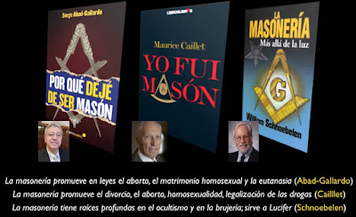

# La Masonería, detrás del movimiento herético New Age contra la fe y la Iglesia
Se llama también francmasonería, Orden, Hermandad, Fraternidad. Es una sociedad secreta condenada por la Iglesia Católica desde su aparición en el siglo XVIII. La “alta Masonería” se caracteriza por lo siguiente:
- Ser una asociación esotérica e iniciática, gnóstica y ocultista (en símbolos y ritos, que incluyen fórmulas de magia, astrología, doctrinas antiguas e iluminismo).
- Rendir juramento (con penas severas y hasta la muerte misma) y obediencia ciega (a sus jefes superiores).
- Negar a Dios Uno y Trino (rinde culto al “Gran Arquitecto del Universo”=“Abadón”=Lucifer).
- Creer en la razón humana como única forma de conocimiento.
- Conspirar contra el Estado al pretender el poder público subrepticiamente (han participado en varias revoluciones mundiales).
- Según declaraciones de varios ex miembros, buscar en última instancia ¡destruir a la Iglesia Católica!

 

¿Más evidencias? **Benjamin Creme**, Director del Centro Tara, de la organización Share International y "apóstol" del Maitreya, declaró:
“El movimiento masónico es uno de los tres canales principales por medio de los cuales continúa la preparación para la nueva era. En él se encuentran discípulos de los Grandes, quienes están reuniendo impulso progresivamente, y dentro de no mucho tiempo emprenderán la tarea que tienen asignada”.

“¿Cuál es el plan?... la instauración de un nuevo gobierno y orden mundial y una nueva religión bajo el Maitreya”.
Seguir leyendo más aquí: https://es.scribd.com/doc/277813978/Masoneria

<iframe class="scribd_iframe_embed" data-aspect-ratio="0.7080062794348508" data-auto-height="false" frameborder="0" height="800" id="doc_57836" scrolling="no" src="https://www.scribd.com/embeds/277813978/content?start_page=1&amp;view_mode=scroll&amp;access_key=key-PgqjrzQHGG4kKnYwjukb&amp;show_recommendations=true" width="600"></iframe>

Por Jaime Duarte Mtz., Director del CISNE.  
<https://www.cisne.org.mx>  
**@CISNE_2012**

