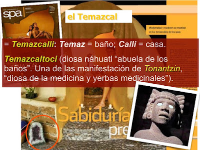

# Baños de Temazcal: ritual neopagano y oculista New Age
“Pero, si solo voy al Temazcal para exfoliarme la piel, ¿por qué es un ritual Nueva Era?", me han preguntado con gran sorpresa. Y yo respondo.

 

1. **La palabra temazcal significa**: temazcalli: temaz = baño; cali = casa (baño en casa) y su origen es religioso, prehispánico. Afuera de la “casa” o cubil, se colocan piedras de cuarzo (por su poder “sanador”).

2. **Antes de ingresar los participantes al cubil, uno, dos o más chamanes** tocan el caracol para invocar a Temazcaltoci = diosa náhuatl “abuela de los baños”. (Una de las manifestaciones de Tonantzin (“diosa de la medicina y yerbas medicinales” y una más de las manifestaciones de la diosa Madre Tierra o Madre Naturaleza). Dicha deidad “vendría” a “purificar el alma” y no a exfoliar la piel. Por cierto: las brujas le rinden culto a la Madre Tierra (también llamada Gaia en la mitología griega, Buhmi en la hindú y Pachamama por los suramericanos).

3. **En el interior, a más de 50º C, se realiza una dinámica de cantos y rezos** dedicados a Temazcaltoci (cuya efigie de piedra se encuentra hoy en el Museo Nacional de Antropología e Historia en México). Ello, sin contar otro tipo de prácticas hechiceras y viajes astrales que se incorporan.

4. **Y al salir del cubil, si aguantó usted el tremendo calor, el o los chamanes** despiden a la diosa Temazcaltoci con tambores.

**En conclusión**, la atmósfera (música, los bailes y las piedras) junto con las invocaciones de los brujos a una deidad antigua no dejan lugar a dudas: **se trata de un ritual ocultista en el cual los participantes son víctimas de los espíritus inmundos; quedan consagrados al Maligno** al rendir –a sabiendas o por ignorancia- culto a dioses falsos.

No se confunda: **sólo el sacramento de la Confesión purifica realmente el alma** de nuestros pecados y, no, una figura de roca inerte que se cree violará la seguridad del Museo de Antropología, surcará los cielos y llegará al lugar que usted quiera para… ¡exfoliarle la piel! ¡Por Dios! Y no falta quien discuta conmigo al decir: "¿Y si voy al temazcal pero le canto y bailo a Diosito?" Reviro: pues eso es necedad e ingenuidad de su parte al creer que usted le dará culto a Nuestro Señor metiéndose en la boca del lobo, y no en un templo católico ex profeso.

¿No me cree? Comprúebelo usted: Le invito a leer la siguiente nota íntegra tomada del diario Reforma, suplemento SPA, de noviembre 2007. ¡Abra los ojos! (No hay peor ciego que aquel que no quiere ver).

# "Modernidad y tradición se mezclan en los temazcales de los spas". "Sabiduría prehispánica"

Para equilibrar el agitado ritmo de la vida urbana, se han diseñado dentro de los hoteles de gran clase algunos espacios que buscan el confort de sus huéspedes y el alivio de sus malestares.
En el cuarto piso del hotel W de la Ciudad de México se encuentra el aWay Spa, que se creó con el propósito de restaurar la armonía espiritual y recuperar el balance del cuerpo.
Mediante una serie de **rituales ancestrales** como el temazcal y lo más moderno de la tecnología actual, los visitantes pueden encontrar el bienestar psicofisiológico.
"La palabra 'temazcal' se remonta a la lengua náhuatl y significa 'la casa del baño'. Somos el único spa en un hotel de primer nivel que ofrece este servicio, y por eso es el sello característico del aWay", dice John Freudenthaler, director de ventas y mercadotecnia del hotel W.  

En el ritual, se guarda gran respeto por esta **mágica tradición**. El temazcal simboliza un lugar protegido donde se limpia el cuerpo, se libera el cansancio y se alimenta el alma con **nueva energía para volver a nacer**.
Encierra una **relajación mística**, la cual sólo puede entenderse si se vive en carne propia una sesión regenerativa. La experiencia conduce a los seres humanos hacia un cambio positivo en su desarrollo interno y en la convivencia social.
"Al alcanzar una fase superior, **equilibramos la energía vital** que circula por nuestro cuerpo", explica Freudenthaler.

**Proceso regenerativo**  
El temazcal del hotel W es de forma redonda. El interior es amplio para que los invitados se sientan cómodos y disfruten al máximo de la sesión.
La ceremonia es impartida por el experto **chamán** Isaac Ortiz, quien proviene de una familia de chamanes que ha transmitido a cada generación los métodos ancestrales. Isaac, a su vez, combinó este conocimiento con sus estudios universitarios en antropología y herbolaria.
Antes de ingresar al temazcal, debe **solicitarse** un respetuoso "permiso". Para ello, el chamán toca una especie de tambores y sopla a través de caracoles prehispánicos.  
Dentro de la bóveda, hay un horno de barro, en el cual se calientan piedras provenientes del Popocatépetl. Cuando las rocas alcanzan su máxima temperatura, se depositan en un hoyo que se encuentra al centro del temazcal.
Posteriormente, las personas se acomodan en círculo y se llevan a cabo varias **dinámicas de canto, rezo y curación**. En esta etapa, se utiliza un té especial que combina hierbas como ruda, eucalipto, albahaca y romero.
En el interior se produce un denso vapor que algunos describen como "bruma mágica", pues los lleva hacia una experiencia sensorial donde se mezclan colores, aromas, imágenes y sonidos.

Al terminar el ritual, se recomienda tomar un baño de agua fría, descansar e hidratarse con agua de cítricos. De esta manera, el cuerpo y la mente renacen como si fueran un nuevo ser.   
Fin de nota.  
por Arturo Emilio Escobar
